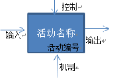
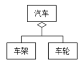
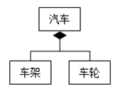
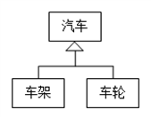
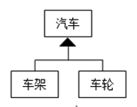
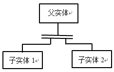
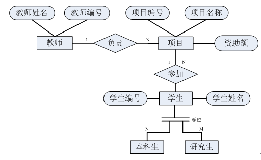
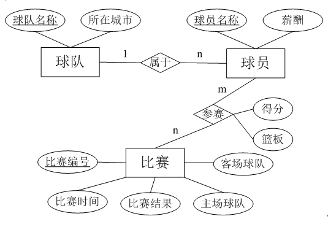
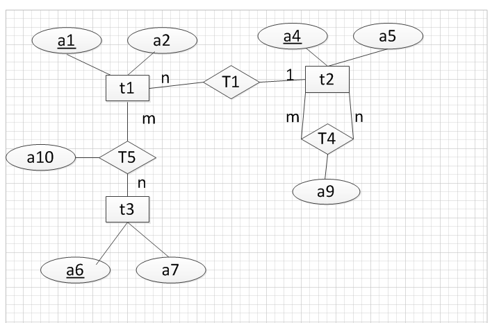

# 全国计算机等级考试三级数据库技术

## 习题

### 分布式数据库系统的“分片透明性”位于（）
分布式数据库系统按不同层次提供的分布透明性有：分片透明性、位置透明性、局部数据模型透明性。
其中分片透明性是分布式数据库中最高层次的分布透明性，位于全局概念模型和分片模型之间。
用户编写程序只须对全局关系进行操作，不必考虑数据的分片及存储场地。
当分片模式改变时，只须改变全局概念到分片模式的映象，而不会影响全局概念模式和应用程序，即实现了分片透明性。

*-- 252页*

### 事务调度

事务是构成数据库应用中一个独立逻辑工作单元的操作的集合，也是访问并可能更新数据库中各种数据项的一个程序执行单元。
数据库系统通过执行各种事务实现对数据库数据的操作，管理和执行事务是DBMS的基本功能。
事务的四大特性为：
- 原子性；
- 一致性；
- 隔离性；
- 持久性。
事务调度则是为了保证事务的此四大特性。
调度分为串行调度和并发调度。
串行调度的特点是一个事务的所有操作都执行完后才开始执行另一事务，不存在事务操作的交叉执行；
不同事务操作的交叉执行称为并发调度，DBMS交叉执行来自多个事务的各个操作，以提高数据库系统的性能。并发调度中不同的事务的操作可以交叉执行。

### 假如有两个表的连接是这样的： table_1 INNER JOIN table_2 其中table_1和table_2是两个具有公共属性的表，这种连接会生成（ ）结果集。

某些情况下，需要把数字数据类型显示为相应的文本名称，这就碰到了多表连接建立记录集的问题。
多表连接的类型主要有 left join、right join 和 inner join。
其主要区别如下：
- left join(左联接)，返回包括左表中的所有记录和右表中联结字段相等的记录（显示左表所有数据，右表匹配不上的显示为NULL）；
- right join(右联接)，返回包括右表中的所有记录和左表中联结字段相等的记录（显示右表所有数据，左表匹配不上的显示为NULL）；
- inner join(等值连接)，只返回两个表中联结字段相等的行（显示左右两表能完全匹配的数据）。

因此本题采用inner join，结果集将返回包括table_1和table_2都满足条件的行。

### 有教师表（教师号，教师名，职称，基本工资），其中基本工资和取值与教师职称有关，实现这个约束的可行方案是（）

触发器（trigger）是SQL Server 提供给程序员和数据分析员用来保证数据完整性的一种方法，它是与表事件相关的特殊的存储过程，执行不是由程序调用，也不是手工启动，而是由事件来触发，比如当对一个表进行操作（ insert，delete， update）时就会激活它并执行，且经常用于加强数据的完整性约束和业务规则等。
教师表中要求基本工资的取值与教师的职称有关，即当对教师的职称进行操作的时候，要求基本工资的取值随着职称变化而变化，因此采用触发器可以达到要求。

### 事务日志用于保存（ 对数据的更新操作 ）

事务日志是一个与数据库文件分开的文件。它存储对数据库进行的所有更改，并记录全部插入、更新、删除、提交、回退和数据库模式变化等操作。
事务日志是数据备份和数据恢复的重要文件，也是使用 SQL Remote 或 ［复制代理］ 复制数据所必需的。

### 有表SCORE(Sno,Cno,Degree)，查询该表中最高分的学生学号和课程号：

```
SELECT {blank}
FROM SCORE
WHERE Degree = {blank}
```

【答案】
- Sno as 学号,Cno as课程号
- (SELECT MAX(S1.Degree) FROM SCORES1)

### 数据库管理员要随时观察数据库的动态变化，并在数据库出现错误、故障或产生不适应的情况时能够随时采取有效措施保护数据库。这种监控机制称为 () 。

对数据库系统的监控分为手动监控机制和自动监控机制两种。

### 每TPS代价值是用于衡量系统（）比的指标。

性价或性能价格

DBAS的性能指标有：
1. 数据操作响应时间(或数据访问响应时间)：从提交请求到返回结果的时间；
2. 系统吞吐量：指系统在单位时间内所完成的事务或查询的数量，单位为TPS；
3. 允许并发访问的最大用户数：在保证响应时间的前提下，系统最多允许多少用户同时访问数据库；
4. 每TPS代价值，用于衡量系统性价(性能价格)比的指标

### DFD方法由四种基本元素构成，它们是{blank}、处理、数据存储和外部项。

数据流

### UML中的{blank}图的主要作用是陈述活动与活动之间流程控制的转移，其作用类似于流程图，然而与流程图不同的是其支持并行行为。

此题考查活动图的主要作用，在UML中，对于业务流程支持的主要图形是`活动图`，活动图主要的目的在于陈述活动与活动之间的流程控制的转移。一般来说，活动图最适合用于描述系统或子系统的主要的工作流程。
其他常用的图还有如下几种：
- 类图是展现一组类、接口和协作以及它们之间的关系的一种静态视图。
- 协作图是交互图的一种，其中包含一组对象、对象之间的联系以及对象间发送和接收的消息。
- 状态图主要用来描述一个实体在发生一些事件时的状态变化情况，用于展示该实体处于不同状态时对不同事件做出响应后的状态变化情况。
- 顺序图是用来描述对象自身及对象间信息传递顺序的视图。

### 设有学生表（学号，姓名，所在系）和选课表（学号，课程号，成绩），现要利用开窗函数查询每个学生的姓名、所在系及选课门数（不包括没选课的学生）。请补全下列语句：

``` sql
SELECT DISTINCT 姓名, 所在系, COUNT(*) {blank}AS 选课门数 FROM 学生表 T1 JOIN 选课表 T2 ON T1.学号 = T2.学号
```

`OVER(PARTITION BY T1.学号) 或 OVER(PARTITION BY T2.学号)`

开窗函数公式：`函数名(列) OVER(选项)`
OVER关键字表示把函数当成开窗函数而不是聚合函数。
SQL SERVER 2005/2008支持两种开窗函数，分别为：排名开窗函数和聚集开窗函数。
聚合开窗函数只能使用PARTITION BY子句不带任何语句，ORDER BY不能与聚合开窗函数一同使用。很多聚合函数都可以用作窗口函数的运算，如SUM,AVG,MAX,MIN，COUNT。

### 在T-SQL中，提取cur1游标中相对于当前行向下第5行数据的语句是
```
FETCH {blank}5 FROM cur1 …
```

`RELATIVE`


【解析】FETCH的功能是通过 Transact-SQL 服务器游标检索特定行，具体语法：
``` sql
FETCH [[NEXT|PRIOR|FIRST|LAST|ABSOLUTE{n|@nvar } | RELATIVE { n | @nvar }] FROM]{{[GLOBAL]cursor_name}|@cursor_variable_name}[INTO@variable_name [ ,...n ]]
```
参数说明：
- NEXT：紧跟当前行返回结果行，并且当前行递增为返回行。如果 FETCH NEXT 为对游标的第一次提取操作，则返回结果集中的第一行。NEXT 为默认的游标提取选项。
- PRIOR：搜索返回紧邻当前行前面的结果行，并且当前行递减为返回行。如果 FETCH PRIOR： 为对游标的第一次提取操作，则没有行返回并且游标置于第一行之前。
- FIRST：返回游标中的第一行并将其作为当前行
- LAST：返回游标中的最后一行并将其作为当前行搜索。
- ABSOLUTE { n | @nvar}：如果 n 或 @nvar 为正，则返回从游标头开始向后的第 n 行，并将返回行变成新的当前行。如果 n 或 @nvar 为负，则返回从游标末尾开始向前的第 n 行，并将返回行变成新的当前行。如果 n 或 @nvar 为 0，则不返回行。n 必须是整数常量，并且 @nvar 的数据类型必须为 smallint、tinyint 或 int。
- RELATIVE { n | @nvar}：如果 n 或 @nvar 为正，则返回从当前行开始向后的第 n 行，并将返回行变成新的当前行。如果 n 或 @nvar 为负，则返回从当前行开始向前的第 n 行，并将返回行变成新的当前行。如果 n 或 @nvar 为 0，则返回当前行。在对游标进行第一次提取时，如果在将 n 或 @nvar 设置为负数或 0 的情况下指定 FETCH RELATIVE，则不返回行。n 必须是整数常量，@nvar 的数据类型必须为 smallint、tinyint 或 int。

### 在T-SQL中，修改用户自定义函数fun1的T-SQL语句是{blank}fun1 …

- CREATE FUNCTION -- 定义一个新函数。
- ALTER FUNCTION -- 修改一个函数的定义。
- DROP FUNCTION -- 删除一个函数。

### 在SQL Server 2008中，在T表的c1列上定义唯一非聚集索引（索引名为idx1）的SQL语句是

``` sql
CREATE {blank}INDEX idx1 ON T(c1)
```

UNIQUE NONCLUSTERED

``` sql
CREATE [UNIQUE|CLUSTERED| NONCLUSTERED] INDEX INDEX_NAME ON TABLE_NAME(PROPERTY_NAME)
```

其中UNIQUE和CLUSTERED为可选项，分别是建立唯一索引和聚簇索引。
- UNIQUE:表示此索引的每一个索引值只对应唯一的数据。
- CLUSTERED:表示要建立的索引是聚簇索引，即索引项的顺序与表中记录的物理顺序一致的索引组织。
- NONCLUSTERED是非聚集索引。

### 在SQL Server 2008中，具有全部用户表数据的增、删、改权限的数据库角色是{blank}。

SQL Server固定的数据库角色及其权限如下：
- db_owner ：具有在数据库中进行全部操作的权限，包括配置、维护数据库及删除数据库。
- db_accessadmin： 可以添加或删除数据库用户的权限。
- db_securityadmin ：具有管理数据库角色、角色成员以及数据库中的语句和对象的权限。
- db_ddladmin： 具有执行数据定义语言（DDL）的权限。
- db_backupoperator： 具有备份数据库、备份日志的权限。
- db_datareader： 具有查询数据库中所有用户数据的权限。
- db_datawriter： 具有插入、删除和更新数据库中所有用户数据的权限。
- db_denydatareader： 不允许具有查询数据库中所有用户数据的权限，等同于对所有的表和视图授予了DENY SELECT权限。
- db_denydatawriter ：不允许具有INSERT、DELETE和UPDATE数据库中所有用户数据的权限。

### 在进行数据库模式调整使用分割表进行数据库优化时，一般有两种表分割方式：{blank}分割和垂直分割。

在进行数据库模式调整使用分割表进行数据库优化时，一般有两种表分割方式：水平分割和垂直分割。

### 新增汇总表的调优方法是一种以空间换{blank}的调优方法。

时间

### 设SQL Server 2008中有students数据库，需要对其进行事务日志备份，直接备份到D:\LogData目录下（此目录已存在）的 Students_log.bak文件上，请补全下列语句：

``` sql
BACKUP {blank} students TO DISK ='D:\LogData\Students_log.bak'
```

备份日志的语法：

``` sql
BACKUP LOG database_name（数据库名）TO backup_device（备份的地方）。
```

### 分布式数据库中，混合分片是水平分片、垂直分片和{blank}分片的混合。

分布式数据库分片类型（数据分布策略）：
- 水平分片是指在关系中从行的角度(元组)依据一定条件划分为不同的片断，关系中的每一行必须至少属于一个片段，以便在需要时可以重构。
- 垂直分片是指在关系中从列的角度(属性)依据一定条件分为不同的片断，各片段中应该包含关系的主码属性，以便通过连接方法恢复关系。
- 导出分片：又称为导出水平分片，分片的依据不是本关系属性的条件，而是其他关系属性的条件。
- 混合分片：以上三种方法的混合。

### 数据仓库的数据模型一般被划分为概念模型、{blank}模型和物理模型。

数据仓库的结构采用三级数据模型的方式，具体如下:
- 概念模型: 也就是业务模型,由企业决策者、商务领域知识专家和IT专家共同企业级地跨领域业务系统需求分析的结果。
- 逻辑模型：用来构建数据仓库的数据库逻辑模型。根据分析系统的实际需求决策构建数据库逻辑关系模型,定义数据库物理结构及其关系。它关联着数据仓库的逻辑模型和物理模型这两头。
- 物理模型：构建数据仓库的物理分布模型,主要包含数据仓库的软硬件配置,资源情况以及数据仓库模式。

### 啤酒和尿布的故事是营销界的神话，啤酒和尿布两个看上去没有关系的商品摆放在一起进行销售获得了很好的销售效益。数据挖掘方法中，{blank}挖掘就是用于发现数据库中数据间的关联性的。

关联规则反映一个事物与其他事物之间的相互依存性和关联性。
如果两个或者多个事物之间存在一定的关联关系，那么，其中一个事物可能存在的行为、特点就能够通过其他事物预测到。
人们希望在海量商业交易记录中发现感兴趣的数据关联关系，借此来帮助商家作出决策。例如，商品分类设计、降价经销分析、生产安排、货架摆放策略等。

### 在一个ER图中，包含三个实体集，分别是员工、部门和项目；员工内部存在一对多的领导联系，员工和部门之间存在一对一的管理联系，员工和部门之间存在多对一的属于联系，员工和项目之间存在多对多的参与联系，部门和项目之间存在一对多的负责联系，则将该ER图转化为关系模型后，得到的关系模式个数是（）。

ER图向关系模式转换涉及到两方面：
- 实体的转换和实体间联系的转换。
- 实体的转换：在从ER图转换为关系模式时，一个实体就转换成一个关系模式，实体的属性就是关系模式的属性，实体的键就是关系的主键。
- 实体间联系的转换：实体间存在三种联系,即1:1（一对一）联系,1:m（一对多）联系，m:n（多对多）联系。

在从ER向关系模式转换规则如下：
- 1:1（一对一）联系
方法一：联系转换为独立的关系模式；模式的属性由联系本身的属性及两个实体的键构成；主键由两个实体中的任意一个键构成。
方法二：联系与一端的实体的关系模式合并，即将联系的属性加入到实体的关系模式内，主键不变。
- 1:m（一对多）联系
方法一：联系转换为独立的关系模式；模式的属性由联系本身的属性及两个实体的键构成；主键由n端实体的键组成。
方法二：与n端的实体的关系模式合并，即将联系的属性加入到实体的关系模式内，主键不变。
- m:n（多对多）联系
多对多联系转换成新的独立的模式时，模式的属性由联系本身的属性及两个实体的键构成，主键由两端实体的键组合而成。

由题目可知，该题中有三个实体、一个1:1（一对一）联系、三个1:m（一对多）联系和一个m:n（多对多）联系。三个实体和一个m:n（多对多）联系可以转换为单独的模式，1:1（一对一）联系和一对1:m（一对多）联系需要合并到实体中去。因此可以最终得到四个模式，即三个实体（员工，部门，项目）和一个多对多联系，故选择A选项。


### 数据库应用系统物理设计阶段活动（）。

物理设计阶段的主要活动有：
- 确定存储结构
- 存取路径的选择和调整
- 确定数据存放位置和确定存储分配。

数据库备份与恢复设计属于数据库日常维护活动。

### DFD建模方法由四种基本元素组成，其中用来描述数据的提供者或使用者的是（）。

数据流图（Data Flow Diagram）：简称DFD，主要组成包括 外部实体（外部项）、处理过程、数据存储和数据流。
- 外部实体指系统之外又和系统有联系的人或者事物，说明了数据的外部来源和去处。
- 处理指对数据逻辑处理，也就是数据变换，它用来改变数据值。
- 数据流是指处理功能的输入输出数据存储表示数据保存的地方，它用来存储数据。

### 从功能角度数据库应用系统可以划分为四个层次，其中负责与DBMS交互以获取应用系统所需数据的是（）。

- 表示层：用于显示数据和接收用户输入的数据。(一般为Windows应用程序或Web应用程序)。
- 业务逻辑层：是表示层和数据访问层之间的桥梁，主要负责数据的传递和处理。
- 数据访问层：实现对数据的保存和读取操作。可以访问关系数据库、文本文件或XML文档等。
- 数据持久层：以程序为媒介把表现层或服务层的数据持久,它是位于物理层和数据访问层之间。

### 现有商品表(商品号，商品名，商品价格，商品描述)，销售表（顾客号，商品号，销售数量，销售日期）。关于性能优化有以下做法：

Ⅰ．因为很少用到商品描述属性，可以将其单独存储
Ⅱ．因为经常按照商品名查询商品的销售数量，可以在销售表中添加商品名属性
Ⅲ．因为经常执行商品表和销售表之间的连接操作，可以将它们组织成聚集文件
Ⅳ．因为经常按照商品号对销售表执行分组操作，可以将销售表组织成散列文件
以上做法中，正确的是（）。


Ⅰ：因为很少用到商品描述属性，系统在查询时也就很少查询。因此可以将其分割，这样虽然破坏了表的整体性，却可以将系统得到优化。
Ⅱ：增加冗余列是指在多个表中增加具有相同语义的列，它常用来在查询时避免连接操作，值得一提的是，主码和外码在多表中重复出现不属于冗余列，这里指得冗余列是非关键字字段在多表的中的出现。由于表的连接操作是比较费时的，如果在表中增加冗余列，则在行上执行查询操作时不需要进行表的连接操作，从而提高了查询效率。
Ⅲ : 一个聚集是一组表，可将经常一起使用的具有同一公共列值的多个表中的数据行存储在一起。对于经常频繁一起查询的表，使用聚集比较方便。
Ⅳ：通常在运行 Order By 和 Group By 语句时会涉及到排序的操作，尤其是对大型的表进行重复的排序，会引起磁盘很大的开销。而散列文件的优点是：文件随机存放，记录不需进行排序；插入、删除方便；存取速度快；不需要索引区，节省存储空间。因此带有Order By和Group By的表可以使用散列文件存储，提高查询效率。

### 基于严格的、明确的需求作为软件系统开发基础的软件开发模型是（ ）。

根据瀑布模型6个阶段的任务可知
- 瀑布模型是基于严格的、明确的需求作为软件系统开发基础的软件开发模型；
- 快速原型模型是一种快速开发方法，其指导思想是不必把前期各阶段的活动做得尽善尽美后才启动下阶段的活动；
- 螺旋模型是将瀑布模型的系统化与快速模型的可修改性结合起来，引入风险评估活动。


### 从功能角度数据库应用系统可以划分为四个层次，其中用户使用create procedure命令所定义的存储过程位于（ ）。

- 表示层负责所有与用户交互的功能，用户对数据库应用系统的最直观感受均在这层实现；
- 业务逻辑层负责根据业务逻辑需要将表示层获取的数据进行组织后，传递给数据访问层，或将数据访问层获取的数据进行相应的加工处理，传送给表示层用于展示；
- 数据访问层负责与DBMS系统进行交互，提取或存入应用系统所需的数据；
- 数据持久层负责保存和管理应用系统数据。

使用`CREATE PROCEDURE`命令所定义的存储过程应属于数据访问层。

### 在IDEF1X数据建模方法中，学生实体集被划分为研究生和本科生，则学生和本科生之间的联系是（ ）。

分类联系是指两个或者多个实体集之间的联系，且这些实体集中存在一个一般实体集，它的每一个实例恰好与一个且仅一个分类实体集的一个实例相联系。
在本题中，学生是一般实体集，而本科生是他的一个分类。*-- IDEF1X建模方法 39页*

### 反规范化是将现有的表进行合并，以便提高数据库性能。下列关于反规范化的说法，正确的是（ ）。

A.反规范化总是会提高查询效率
B.反规范化总是会减少数据冗余
C.反规范化总不会降低更新效率
D.反规范化总不会增加连接操作

数据库的反规范化是为了减少表间的连接，提高查询性能，但并非所有经反规范的数据库都是高效的，这与实际的应用有关，只有满足一定条件的数据库采用反规范方法才能提高性能。故答案为D项。

> 在数据库设计阶段，主要强调的是高效率利用存储空间，减少数据的冗余，减少数据的不一致，这个过程也就是规范化的过程。
> 反规范化是将规范化的关系转换为非规范化关系的过程，方法：
- 增加派生性冗余列（表中增加的列由表中的一些数据项经过计算生成。作用：减少连接操作，避免使用聚合函数。）
- 增加冗余列（主码与外码在多表中的重复出现不属于冗余列，前提条件：要保证冗余列及其对应列数据的一致性。）
- 重新组表
- 分割表（表中数据过于庞大或表中数据具有使用独立性）。
  水平分割：根据数据行的使用特点进行分割，分割之后所得的所有表的结构都相同，而存储的数据不同。水平分割会给应用增加复杂度，特别是查询所有数据时需要 UNION(并) 操作。
  垂直分割：根据数据列的特点进行分割，分割之后所有表中除了都含有主码列外其余列都不相同。把常用和不常用的列分别放入不同的表中，数据行变小，查询时减少 I/O 次数，缺点是查询所有数据时需要 JOIN(连接) 操作。
- 新增汇总表（大量执行报表等汇总操作）对大批量的数据进行实时访问，同时对数据进行加和、取平均等操作。

第10章 - 数据库运行维护与优化 - 模式调整与优化 - 203页

### 下列关于SQL Server 2008数据库文件的说法，正确的是（ ）。

A.一个数据库可以包含多个主要数据文件
B.主要数据文件的扩展名必须为.mdf
C.日志文件必须属于一个文件组
D.定义数据文件时如果没有指定文件组则其属于默认文件组

- 一个数据库只允许有一个主要数据文件，可以有多个次要数据文件。
- 主要数据文件的推荐扩展名是.mdf，次要数据文件的推荐扩展名是.ndf。
- 日志文件不包括在文件组内，日志空间与数据空间是分开管理的。
- 如果在定义数据文件时没有指定其所属的文件组，则新建数据文件将被分配到默认文件组。

### 下列关于SQL Server 2008 系统数据库的说法，错误的是（ ）。

A.master数据库记录了SQL Server实例的所有系统级信息
B.SQL Server实例的作业信息存储在master数据库中
C.对model数据库的修改将应用于以后创建的所有用户数据库
D.每次启动SQL Server时都会重新创建tempdb数据库

SQL Server实例的作业信息存储在 msdb 数据库中。作业是在 SQLServer 中定义的自动执行的一系列操作的集合，作业的执行不需要任何人工干预。

### 美国国防部发布的橘皮书和紫皮书对强制存取控制进行了全面的描述和定义，给出了通用安全性分级模式，定义了四类安全级别，其中提供验证保护的是（ ）。

- A类提供验证保护
- B类提供强制保护
- C类提供自主保护
- D类提供最小保护

橘皮书定义了任意“可信橘色基”应当遵从一系列安全性要求；
紫皮书定义了这些要求在数据库系统中的相应解释。
通用安全性分级模式，共定义了 D、C、B 和 A 四类安全级别，从D类到A类级别依次增高。
- D 类提供最小保护(Minimal)。
- C 类提供自主保护(Discretionary)。
- B 类提供强制保护(Mandatory)。
- A 类提供验证保护(Verified)。

第 9 章 - 安全管理 - 178页

### 设某数据库服务器中配置有3块300GB的硬盘，为了保证可靠性，数据库管理员在3块硬盘上建立了RAID5。建立RAID5后，可用的磁盘空间为（ ）。

建立RAID5后，可用的磁盘空间是2*300GB=600GB容量。对于任意三块磁盘，RAID5容量等于最小的一块磁盘容量*2。

### 设某公司有一个基于SQL Server 2008的信息管理系统，此系统需要7x24小时运行，系统数据量很大，但数据变化量较小。此系统能够容忍的数据丢失时间为1小时。关于该数据库应设置的恢复模式最恰当的是（ ）。

SQL Server 2008支持三种恢复模式：简单恢复模式、完整恢复模式和大容量日志恢复模式。 228页

- 简单恢复模式只用于测试和开发数据库，或用于主要包含只读数据的数据库（如数据仓库），这种模式并不适合生产系统。
- 完整恢复模式完整地记录所有的事务，并将事务日志记录保留到对其备份完毕为止。如果备份日志尾部，则可以使用完整恢复模式将数据库恢复到故障点。完整恢复模式还支持还原单个数据页。
- 大容量日志恢复模式一般只作为完整恢复模式的附加模式，该模式不支持时点恢复。

### 在分布式数据库中，查询优化需要考虑的主要因素包括I/O代价、CPU代价和通信代价。一般而言，分布式数据库查询优化的首要目标是（）。

在分布式数据库中，由于数据分布在不同的场地上，使得查询处理中还要考虑站点之间传输数据的通信代价，使得查询处理中还要考虑站点间传输数据的通信代价。

### 在数据仓库设计中，数据的粒度级设计是一个重要的问题。在粒度级设计中，考虑因素：

- 在数据仓库环境中，粒度是一个重要的设计问题，它影响到数据仓库的数据量以及系统能回答的查询的类型。
- 在进行粒度级设计时，在可用的存储空间中保存粗细程度不同的主题数据，以尽可能满足各种应用的多角度、多层次数据查询要求，同时在总体上提高查询的设计效率。粒度越小，则细节程度越高，综合程度就越低，回答查询的类型也越多，数据量比较大，空间代价也大。
- 用户查询所涉及的数据的最低细节程度、用户查询的平均性能需求、系统的可用存储空间、低粒度级数据的规模都属于主要考虑的因素。

### 在数据文件的{blank}属性集上建立的索引称作主索引。

在数据库文件的主码属性集上建立的索引称为主索引。

### 在三层浏览器/服务器体系结构的数据库应用系统中，Web浏览器实现的是{blank}层的功能。

DBAS总体设计 - 65页

将数据处理功能分解并分布在表示层、功能层和数据层三个层次上：
- 表示层位于客户端，由 Web 浏览器实现。
- 功能层位于 web 应用服务器，实现面向具体应用的领域的业务规则。
- 数据层位于数据库服务器，通过 DBMS 完成具体的数据存储和数据读取等数据管理功能。

### 用于描述系统、用例和程序模块中逻辑流程执行次序的UML图称为{blank}图。

在UML提供的图中，活动图主要用于描述系统、用例和程序模块中逻辑流程执行次序。

### 现要统计T1表中C1列取值不同的值的个数。请补全下列语句：

``` sql
SELECT {blank} FROM T1
```

`COUNT(DISTINCT C1)`

在SQL语言中，COUNT是把符合条件的记录条数计算出来，使用DISTINCT关键字去除查询结果重复行的所有记录。题目中要求统计T1表中C1列取值不同的值的个数，查询语句为：SELECT COUNT(DISTINCT C1) FROM T1。故答案为COUNT(DISTINCT C1)。

### 设有表 选课（学号，课程号，成绩），现要查询没选C01课程的学生学号。请补全下列语句：
SELECT 学号 FROM 选课 t1 WHERE {blank}
(SELECT * FROM 选课 t2
WHERE t1.学号 = t2.学号 and t2.课程号 = 'C01')

在SQL语言中，使用 NOT EXISTS 表示查询的结果是选课表中没选C01课程的学生学号中的数据记录。故答案为NOT EXISTS。

### 设在SQL Server某数据库中有表 选课（学号，课程号，成绩），现要定义限制每个学生的选课总门数不能超过10门的前触发型触发器。请补全下列语句：
CREATE TRIGGER tri_cnt ON 选课{blank}INSERT
AS … …

建立DML触发器SQL语句为 CREATE TRIGGER，其语法格式为：

``` sql
CREATE TRIGGER < Trigger_name >
ON{table|view}
{FOR|AFTER|INSTEAD OF}
{[INSERT][,][UPDATE][,][DELETE]}
AS {sql_statement}
…
```
使用 INSTEAD OF 选项定义的触发器为前触发型触发器，根据题意要求限制每个学生的选课总门数不能超过10门的前触发型触发器，所以使用INSTEAD OF选项定义。

第 8 章 数据库后台编程技术 - 触发器 162页 做完此题看一遍书理解概念。

### 设在SQL Server某数据库中有表 选课（学号，课程号，成绩）。现要声明一个查询成绩大于等于90的学生学号、课程号和成绩的游标。请补全下列语句：
DECLARE c1 {blank} FOR
SELECT 学号, 课程号, 成绩 FROM 选课 WHERE 成绩 >=90

使用游标之前，要声明游标，ISO声明游标的简化语法格式如下：

```sql
DECLARE cursor_name [INSENSITIVE] [SCROLL] CURSOR
FOR select_statement
[FOR{READ ONLY|UPDATE[OF column_name[,…n]]}]
```

SQL Server中声明使用DECLARE CURSOR语句，声明游标包括定义游标的滚动行为和用户生成游标所操作的结果集的查询。故答案为CURSOR。

第 8 章 数据库后台编程技术 - 游标 166页 做完此题看一遍书理解概念。

### 设在SQL Server中，要在Employee表的eid列上建立一个聚集索引。请补全下列语句：
CREATE{blank}INDEX idx1 ON Employee(eid)

创建索引使用CREATE INDEX语句。SQL Server 2008创建索引的简化语法格式为：

``` sql
CREATE [UNIQUE][CLUSTERED|NONCLUSTERED] INDEX index_name
ON <object> (column[ASC|DESC][,…n])
…
```
根据题意要在Employee表的eid列上建立一个聚集索引，需要使用CLUSTERED。故答案为CLUSTERED。

146页 - 索引

聚集索引? 50页 有序索引 - 聚集索引和非聚集索引。

### 设在SQL Server中，要创建SQL Server身份验证的登录账户，登录名为：User1，密码为：a123。请补全下列语句

CREATE {blank} User1 WITH PASSWORD = 'a123'

创建新的登录账户的T-SQL语句是CREATE LOGIN。故答案为LOGIN。

### 在一个事务执行过程中，其正在访问的数据被其他事务所修改，导致处理结果不正确，这是由于违背了事务性质中的{blank}性而引起的。

为了保证事务的正确执行，维护数据库的完整性，要求数据库系统维护以下事务特性：
① 原子性：事务的所有操作在数据库中要么全部正确反映出来，要么全部不反映。
② 一致性：事务的隔离执行（即没有并发执行的其他事务），保持数据库的一致性。
③ 隔离性：尽管多个事务可以并发执行，但系统必须保证，对任一对事务Ti和Tj，在Ti看来，Tj或者在Ti开始之前已经停止执行，或者在Ti完成之后开始执行。这样，每个事务都感觉不到系统中有其他事务在并发地执行。
④ 持久性：一个事务成功完成后，它对数据库的改变必须是永久的，即使系统可以出现故障。
根据题意，正在访问的数据被其他事务所修改违背了事务性质的隔离性。故答案为隔离。

### 在数据库并发控制中，锁的粒度越{blank}，事务并发执行程度就越小，数据库系统开销也越小。

数据库管理系统对事务的并发执行进行控制，以保证数据库一致性，最常用的方法是封锁的方法。封锁粒度与系统的并发度和并发控制的开销密切相关。封锁的粒度越大，并发度就越小，同时系统的开销就越小。封锁的粒度越小，并发度就越大，同时系统的开销就越大。故答案为大或粗。

### 在SQL Server 2008中，数据库镜像分为高{blank}操作模式、高保护操作模式和高性能操作模式。

数据库镜像提供了3种实现方式：
① 高可用性：两台服务器上同步事务写入，并支持自动错误恢复。
② 高保护：两台服务器上同步事务写入，但是错误恢复是手工的。
③ 高性能：两台服务器上的写入可以不同步，因此在性能上有所提高，只允许手工的错误恢复。
故答案为可用。

### 并行数据库有多种体系结构，其中所有处理机通过网络共享一个公共的主存储器的结构称为{blank}结构。

并行数据库系统有多种体系结构，主要可分为共享内存结构、共享磁盘结构、无共享结构和层次结构。
在共享内存结构中，所有的处理机通过互联网共享一个公共的主存储器。故答案为共享内存或内存共享。

### 在数据仓库中，根据数据源的变化量在维护对象原有数据的基础上对数据进行维护的方法称为{blank}维护法。

数据仓库维护的基本思想是：
- 根据某种维护策略，在一定条件下触发维护操作；
- 维护操作捕捉到数据源的数据变化；
- 通过一定策略对数据仓库中的数据进行相应的更新操作，以保持两者的一致性。
增量式维护指的是根据数据源的变化量在维护对象原有数据和基础上进行数据添加和修改。故答案为增量或增长。

### 在IDEF1X数据建模方法中，如果一个实体集的唯一标识有赖于该实体集与其他实体集的联系，则称这种类型的实体集为{blank}实体集。

在IDEF1X模型元素中，如果一个实体集的一个实例的唯一标识依赖于该实体集与其他实体集的联系，那么他就是丛属标识符实体或简称为从属实体集。

IDEF1X 建模方法 - 39页

### 如果索引文件只包含了数据文件中的部分查找码，则称该索引为{blank}索引。

- 如果数据文件中的每个查找码值在索引文件中都对应一个索引记录，则该索引称为稠密索引（Dense Index）；
- 如果只是一部分查找码的值有对应的索引记录，则该索引称为稀疏索引（Sparse Index）。

### 顺序图有两个坐标轴，横向表示对象，纵向表示{blank}的持续过程。

顺序图主要用于描述系统内对象之间的消息发送和接收序列，有两个坐标轴：纵向表示时间的持续过程，横向表示对象。

### 在SQL Server中，现要查询T1表中C1列值最大的2行数据（不考虑并列情况）。请补全下列语句：
``` sql
SELECT{blank}*FROM T1 ORDER BY C1 DESC
```
108页

当使用SELECT语句进行查询时，有时只希望列出结果集中的前几行数据，而不是全部数据，就可以使用TOP谓词来限制输出的结果。使用TOP谓词的语法格式为：
    TOP n [ percent ] [ WITH TIES ]；其中，n为非负整数。
①TOP n：取查询结果的前n行数据；
②TOP n percent：取查询结果的前n%行数据；
③WITH TIES：表示包括最后一行取值并列的结果。
TOP谓词写在SELECT单词的后边（如果有DISTINCT的话，则TOP写在DISTINCT的后边）、查询列表的前边。

根据题意，要查询T1表中C1列值最大的2行数据（不考虑并列情况），所以n=2。
故答案为TOP 2或TOP (2)或TOP(2)。

> 注意：在使用 TOP 谓词时应该与 ORDER BY 字句一起使用，这样的前几名才有意义。当使用 WITH TIES 时，则必须要求使用 ORDER BY 字句。

### 设有表 选课（学号，课程号，成绩），现要查询没选C01课程的学生学号。请补全下列语句：

SELECT 学号 FROM 选课 WHERE 学号 {blank}
(SELECT 学号 FROM 选课 WHERE 课程号 = 'C01')

### 设有表 选课（学号，课程号，成绩），现要查询没选C01课程的学生学号。请补全下列语句：

SELECT 学号 FROM 选课 t1 WHERE {blank}
(SELECT * FROM 选课 t2
WHERE t1.学号 = t2.学号 and t2.课程号 = 'C01')

1. 若WHERE条件是判断用户不在某个集合当中，一般使用NOT IN子句。
2. 使用NOT EXISTS表示查询的结果是选课表中没选C01课程的学生学号中的数据记录。

### 在SQL Server中，设有表 选课（学号，课程号，成绩）。现要声明一个查询成绩大于等于90的学生学号、课程号和成绩的游标。请补全下列语句：

DECLARE c1 CURSOR {blank}
SELECT 学号, 课程号, 成绩 FROM 选课 WHERE 成绩 >= 90

使用游标之前，要声明游标，ISO声明游标的简化语法格式如下：

``` sql
DECLARE cursor_name [INSENSITIVE] [SCROLL] CURSOR
    FOR select_statement
    [FOR{READ ONLY|UPDATE[OF column_name[,…n]]}]
```

### 设在SQL Server中，要在Student表的sname列上建立一个非聚集索引。请补全下列语句：

CREATE NONCLUSTERED INDEX idx1 ON{blank}

Student(sname)

### 设在SQL Server中，要创建SQL Server身份验证的登录账户。登录名为：User1，密码为：a123。请补全下列语句：

CREATE LOGIN User1{blank}PASSWORD = 'a123'

创建登陆帐户：CREATE LOGIN Username WITH PASSWORD=passwordchar。故答案为WITH。

### 在数据库并发控制中，需要对数据库锁粒度进行控制。锁的粒度越大，事务并发执行程度越{blank}。

注：仔细审题，是事务并发执行程度，我经常看成事务并发程度。
数据库管理系统对事务的并发执行进行控制，以保证数据库一致性，最常用的方法是封锁的方法。封锁粒度与系统的并发度和并发控制的开销密切相关。
封锁的粒度越大，并发度就越小，同时系统的开销就越小。封锁的粒度越小，并发度就越大，同时系统的开销就越大。故答案为低或小。

### 为经常作为查询条件的列建立索引的调优方法是典型的以{blank}换时间的调优方法。

索引为性能所带来的好处是有代价的，因为索引在数据库中会占用一定的存储空间。另外，在对数据进行插入、更改和删除操作时，为了使索引与数据保持一致，还需要对索引进行维护，对索引的维护是需要花费时间的。索引是以空间换时间的一种策略。故答案为空间。

### 云计算通过集中所有的计算资源，采用硬件{blank}技术，为使用者提供强大的计算能力、存储和带宽等资源。

云计算是一种商业计算模型，它通过集中所有的计算资源，采用硬件虚拟化技术，为云计算使用者提供强大的计算能力、存储空间和信息服务，获得与传统大型服务器相同或者更高的计算能力。故答案为虚拟。

### 在多维数据分析中，从高粒度级数据视图切换到低粒度级数据视图的分析操作称为{blank}操作。

所谓钻取（drill down）是指对应于某一维逐步向更细节层方向观察数据，钻取是改变展现数据维度的层次，变换分析的粒度，它包括向上钻取和向下钻取。故答案为钻取或下钻或drill down。

### 在关联规则挖掘中，为了发现有意义的关联规则，需要给定最小{blank}度和最小可信度两个阈值。

关联规则的数据挖掘的主要任务就是在事务数据库中找出给定的具有最小支持度和最小置信度的关联规则，同时满足最小支持度阈值和最小置信度阈值的规则成为强规则。

### 在进行数据库应用系统需求分析时，需要预估系统的吞吐量，这属于数据库应用系统的{blank}需求分析。

DBAS需求分析阶段的另外一项重要工具是分析DBAS应具有的性能指标,主要包括数据操作响应时间、系统吞吐量、允许并发访问的最大用户数、每TPS代价值。
所以,在进行数据库应用系统需求分析时，需要预估系统的吞吐量，这属于数据库应用系统的性能需求分析。

### DFD建模方法由4种基本元素构成，其中数据源或数据终点被称为{blank}项。

DFD方法由4种基本元素（模型对象）组成：数据流、处理、数据存储和外部项。其中，外部项也称数据源或数据终点。

### 通信图是交互图的一种，也被称为{blank}图。

通信图是交互图的一种，也被称为协作图。故答案为协作

### 在SQL Server中，设已声明了游标c1，现要从该游标提取数据，请补全下列语句：

{blank}NEXT FROM C1

游标被声明和打开之后，游标的当前行指针就位于结果集的第一行位置，可以使用FETCH语句从游标结果集中按行提取数据。故答案为FETCH。

### 设在SQL Server中，要为U1定义一个名为Sales的架构。请补全下列语句：

CREATE{blank}
Sales AUTHORIZATION U1

定义架构的SQL语句为CREATE SCHEMA，其语法格式为CREATE SCHEMA [<架构名>] AUTHORIZATION <用户名>。故答案为SCHEMA。

### 某超市管理系统运行过程中出现异常，导致已经提交的事务对数据库的更新结果未能正确写入磁盘，此故障破坏了事务的{blank}性。

由于硬件故障、数据库软件及操作系统的漏洞、突然停电等，正在运行的事务以非正常方式终止，需要系统重新启动的一类故障被称为系统故障，这类故障影响正在运行的所有事务。消除事务对数据库的影响，保证数据库中数据的一致性。办法是在计算机系统重新启动后，对于未完成的事务可能已经写入数据库的内容，回滚所有未完成的事务写的结果，保证数据库中数据的一致性。根据题意在故障发生时，已经提交的事务对数据库的更新结果未能正确写入磁盘，破坏了事务的一致性。故答案为一致或持久或永久。

### 设在SQL Server中，要启用被禁用的User1登录账户。请补全下列语句：

{blank}LOGIN User1 ENABLE

修改登录账户属性的SQL语句是ALTER LOGIN。根据题意要启用被禁用的User1登录账户，完整的语句为ALTER LOGIN User1 ENABLE。故答案为ALTER。

### 分布式数据库系统的恢复控制采用的最典型策略是基于{blank}的提交协议。

分布式数据库系统的恢复控制采用最典型策略是基于两阶段的提交协议，该协议将场地的事务管理分为协调者和参与者。故答案为两阶段或二阶段或2PC或2阶段。

### 下列不属于数据库应用系统系统规划与分析阶段任务的是（）。

A.定义事务规范
B.确定系统范围和边界
C.确定任务目标
D.论证技术可行性

数据库应用系统系统规划与分析阶段任务包括 （4页 规划与分析）
- 系统规划与定义（任务陈述、确定任务目标、确定范围和边界、确定用户视图）
- 可行性分析（技术可行性、经济可行性、操作可行性、开发方案选择）
- 项目规划（项目团队、项目环境、项目活动、成本预算、进度计划）
在需求分析阶段中，数据处理分析结果也可以表示为事务规范。因此，定义事务规范属于需求分析阶段任务,不属于数据库应用系统系统规划与分析阶段任务。故答案为A选项。

### 在IDEF0需求建模方法中，每个功能活动可以用带箭头的矩形框表示，代表功能活动的约束条件的是（）。

组成IDEF0图的基本元素是矩形框和箭头。
- 矩形框代表功能活动，写在矩形框内的动词短语描述功能活动的名称，活动的编号按照要求写在矩形右下角指定的位置。左边的输入箭头表示完成活动需要的数据；
- 矩形框上方的控制箭头描述了影响这个活动执行的事件或约束条件；
- 矩形框右边的输出箭头说明由活动产生的结果及信息。
- 矩形框下方的进入控制箭头表示实施该活动的物理手段或完成活动需要的资源（计算机系统、人或组织）。



### 在IDEF1X建模方法中，下列联系类型中不会产生从属实体集的是（）。

A.非标定型联系
B.分类联系
C.标定型联系
D.由非确定联系转换过来的确定联系

如果实体集的一个实例的唯一标识依赖于该实体集与其他实体集的联系，那么它就是从属标识符实体集或简称为从属实体集；非标定型联系：如果子女实体集中每一个实例都能被唯一地确认而无须了解与之相联系的双亲实体集的实例。所以，非标定型联系不会产生从属实体集。故答案为A选项。  *-- IDEF1X建模方法 39页*

### 将数据库存储介质由RAID 5改为RAID 1以满足越来越多的写操作需求，这一活动属于数据库应用系统运行管理与维护中的（）。

A.日常维护
B.性能优化调整
C.监控与分析
D.系统进化

数据库运行管理与维护的主要工作内容包括日常维护、系统监控与分析、系统性能优化调整、系统进化（升级）等工作。
数据库性能优化调整一般从查询调整与优化、索引调整、事务调整、模式调整、参数调整、硬件调整与升级和应用程序优化等方面考虑。
将数据库存储介质由RAID 5改为RAID 1以满足越来越多的写操作需求，属于硬件调整与升级，提高了数据库的性能。故答案为B选项。

### 根据事务-基本表交叉引用矩阵可以确定哪些事务对哪些表列执行了何种操作，基于该矩阵可以帮助数据库设计人员（）。

事务-基本表交叉引用矩阵，分析系统内（部分重要的）数据库事务对各个基本表的访问情况，确定事务访问了哪些基本表，对这些基本表执行了何种操作，并进一步分析各操作涉及的基本表属性。根据事务数据访问特性分析结果，可以对基本表设计成更为有效的文件组织和索引方式。

### 在数据库应用系统生命周期中，进行项目的成本估算属于下列哪项基本活动（）。

一般来说，项目规划包括以下工作内容：
①确定项目的目标和范围，根据系统规划与定义的工作内容，具体说明项目的最终产品以及期望的时间、成本和质量目标。
②根据DBAS软件开发模型，分解和定义整个项目包括的工作活动和任务。
③估算完成该项目的规模及所需各种资源。
④制定合理的DBAS项目计划，包括进度、成本、质量等方面的预测和控制方案。

### 在IDEF1X数据建模方法中，老师和学生之间的一对多“导师”联系属于（）。

A.标定型联系
B.分类联系
C.非确定联系
D.非标定型联系

根据非标定型联系定义，在“确定型联系”中，如果子女实体集中的每一个实例都能被唯一地确认而无须了解与之相联系的双亲实体集的实例，老师和学生之间的一对多“导师”联系属于“非标定型联系”。故答案为D选项。  *-- IDEF1X建模方法 39页*

### 在进行数据库设计时，考虑到应用主要以分析型查询为主，决定对表采取按列存储的实施方案，这一操作属于数据库的（）。

数据库物理设计主要包括数据库逻辑模式描述、文件组织与存取设计、数据分布设计、确定系统配置和物理模式评估。在进行数据库设计时，考虑到应用主要以分析型查询为主，决定对表采取按列存储的实施方案，这一操作属于数据库物理结构设计中的数据分布设计内容。

### 从功能角度数据库应用系统可以划分为四个层次来实现，构件属于其中的（）。

业务逻辑层的主要任务是梳理DBAS的各项业务活动，将其表示为各种系统构件（如类、模块、组件等）。  *-- 业务逻辑层概要设计 71页*

### 在编写事务时，提高事务的隔离性级别带来的好处是（）。

隔离性表示多个事务并发执行时，每个事务都感觉不到其他事务的存在，就像系统中只有它一个事务在运行一样，从而得到正确的结果，降低了发生数据不一致的可能性。

### 数据完整性约束按照其约束条件的作用对象可以划分为不同级别。已知关系表 排课(课程号，教室号，上课时间)，如果要求每个教室在每个上课时间只能排一门课，则这个约束的完整性级别属于（）。

完整性约束条件的作用对象分为列、元组和关系3种级别：
- 对列的约束主要指对其值类型、范围、精度、排序等的约束条件。
- 对元组的约束主要指对记录中各个属性之间的联系的约束条件。
- 对关系的约束是指对若干记录间、关系集合上以及关系之间联系的约束条件。
根据题意约束的作用的对象是排课关系表，因此属于关系级完整性约束。

*-- 数据库的完整性保护 75页*

### 已知关系员工（员工号，员工名，所属部门号，部门名，部门所在城市，部门负责人），下列操作中不属于数据库物理设计阶段工作的是（）。

A.将该关系对应的表按部门拆分为后勤部员工表和业务部员工表
B.将该关系拆分为员工（员工号，员工名，所属部门号）以及部门（部门号，部门名，部门所在城市，部门负责人）
C.将该关系对应的表按照部门所在城市进行分区
D.对该关系对应的表按照部门负责人建立非聚集索引

数据库物理设计的目的是将数据的逻辑描述转换为实现技术规范，其目标是设计数据存储方案，以便提供足够好的性能并确保数据库数据的完整性、安全性和可恢复性。在这个阶段，将根据数据库中存储的数据量、用户对数据库的使用要求和使用方式，选择数据存储方案以加快数据检索速度。因此，在物理设计时需要了解不同文件组织方式、索引技术及其使用方法。数据表拆分属于数据库逻辑结构阶段的工作，不属于数据库物理设计阶段工作。故答案为B选项。  *-- 46页*

### UML用例图是用于表达DBAS需求的工具。下列关于用例图的说法，错误的是（）。

A.用例之间存在的关系可以包括扩展、使用和组合
B.角色是与系统交互的人或其他实体，一个角色可以执行多个用例
C.用例用椭圆形表示，用例必须位于系统边界的外部
D.用例作为需求搜索及整理工具，主要应用在项目开发的需求分析阶段

用例图由系统、角色和用例3种模型元素以及元素之间的各种关系组成。在用例图中系统用一个长方框来表示，系统的名字写在方框上或方框里面，方框内部还可以包含该系统中用符号表示的用例。角色是与系统交互的人或其他实体，一个角色可以执行多个用例，反过来，一个用例也可被多个角色使用。用例代表的是一个完整的功能，是所有动作的集合。在UML中，用例用椭圆形表示，用例位于系统边界的内部。用例之间也存在关系，包括扩展、使用、组合3种。故答案为C选项。  *-- 87页*

### 下列关于数据备份（转储）工作的说法，正确的是（）。

A.为了保证数据一致性，只能采用静态转储
B.增量转储和差量转储相比速度快，存储空间占用少
C.在制定备份策略时，主要考虑备份空间因素，其他因素可以忽略
D.从数据库恢复角度看，完全转储比增量转储恢复所需时间长

采用静态转储方式，转储前后系统必须处于一个一致性的状态。
差量转储和增量转储相比，速度慢，占用空间较多，但恢复速度比增量转储快。
增量转储的恢复时间要比仅适用完全转储要长。
在设计良好的备份策略时，除了要考虑特定业务要求外，同时还应尽量提高数据的可用性并尽量减少数据的丢失。故答案为B选项。

### 下列有关SQL Server数据库备份内容和备份时间的说法，正确的是（）。

A.清理事务日志之后，建议对用户数据库进行备份
B.创建数据库后，需立即对model数据库进行备份
C.删除用户数据库后，需要对tempdb数据库进行备份
D.新建数据库用户后，建议对model数据库进行备份

清理事务日志的时候，不产生日志备份副本，建议对用户数据库进行备份。执行任一更新数据库的操作后，必须备份model数据库。tempdb数据库与其他任意数据库不同，不仅数据库中的对象是临时的，连数据本身也是临时的，删除用户数据库后，无需对tempdb数据库进行备份。新建数据库用户后，建议对master数据库进行备份。故答案为A选项。

### 在企业数据仓库设计中，数据的粒度级设计是一个重要的问题，在粒度级设计中，设有下列考虑因素（）。

Ⅰ.用户查询所涉及的数据的最低细节程度
Ⅱ.高粒度级数据所需的存储空间
Ⅲ.用户查询的平均性能需求
Ⅳ.系统的可用存储空间
Ⅴ.低粒度级数据的规模
Ⅵ.用户查询所涉及的数据最高粒度级
在以上因素中，属于设计时需要考虑的主要因素是

在数据仓库环境中，粒度是一个重要的设计问题，它影响到数据仓库的数据量以及系统能回答的查询的类型。在进行粒度级设计时，在可用的存储空间中保存粗细程度不同的主题数据，以尽可能满足各种应用的多角度、多层次数据查询要求，同时在总体上提高查询的设计效率。粒度越小，则细节程度越高，综合程度就越低，回答查询的类型也越多，数据量比较大，空间代价也大。用户查询所涉及的数据的最低细节程度、用户查询的平均性能需求、系统的可用存储空间、低粒度级数据的规模都属于主要考虑的因素。

### 如果一个基本表的数据量很小，查询以整表扫描为主，并且会频繁执行更新操作，则存储该表的最佳文件结构是{blank}文件。

堆。因为堆文件无须建立索引，维护代价非常低。   *-- 55页*

### 利用游标机制可以实现对查询结果集的逐行操作。下列关于SQL Server 2008中游标的说法中，错误的是（）

A.每个游标都有一个当前行指针，当游标打开后，当前行指针自动指向结果集的第一行数据
B.如果在声明游标时未指定INSENSITIVE选项，则已提交的对基表的更新都会反映在后面的提取操作中
C.当@@FETCH_STATUS=0时，表明游标当前行指针已经移出了结果集范围
D.关闭游标之后，可以通过OPEN语句再次打开该游标

每个游标都有一个当前行指针，当游标打开后，当前行指针自动指向结果集的第一行数据，INSENSITIVE 关键字用以创建由该游标使用的数据的临时复本。
对游标的所有请求都从 tempdb 中的该临时表中得到应答。因此，在对该游标进行提取操作时，返回的数据中不反映对基表所做的修改，并且该游标不允许修改。使用 SQL-92 语法时，如果省略 INSENSITIVE，任何用户对基表提交的删除和更新都反映在后面的提取中。
- "@@FETCH_STATUS=0"时，表示的含义是FETCH语句成功；
- "@@FETCH_STATUS=-1"时，FETCH 语句失败或行不在结果集中；
- "@@FETCH_STATUS=-2"时，提取的行不存在；
关闭游标之后，可以通过OPEN语句再次打开该游标。

### 在并行数据库中，最适合整表扫描操作的数据划分方法是{blank}。

并行数据库中一维数据的划分方法如下：
（1）轮转法：最适合于扫描整个关系；
（2）散列划分法：比转转法更适合点查询，也适合顺序扫描关系；
（3）范围划分法：明显利于范围查询和点查询。

### 在并行数据库中，{blank} 结构被认为是支持并行数据库系统的最好并行结构，适用于银行出纳之类的应用。

无共享结构每个处理机拥有独立的主存储器和磁盘，不共享任何资源。它被认为是支持并行数据库系统的最好并行结构，比较适用于银行，出纳，民航售票等OLTP类应用。


### 某网上书店根据用户的历史购书记录，采用某种数据挖掘算法分析出用户最可能属于某一类书的爱好者，应该采用（）

常见的数据挖掘任务包括分类、估计、预测、相关性分组或关联规则、聚类和描述、可视化以及复杂数据类型挖掘(Text、 Web、图形图像、视频和音频等)等。
分类分析首先从数据中选出已经分好类的训练集，在该训练集上运用数据挖掘分类的技术，建立分类模型，对于没有分类的数据进行分类。该需求要求根据购书记录将用户映射到倾向于喜欢某种书的顾客特性中，而分类挖掘模型能把数据库中的数据项映射到给定类别的某一个中。

### 类图技术是面向对象方法的核心技术。下列所示UML的类图，正确的是（）

A.<br>
B.<br>
C.<br>
D.<br>

本题考查了有关UML的类图表示。这里的区别主要在四种表示上：类的UML表示（空心三角实线连接）、接口的UML表示（空心三角虚线连接）、聚合关系的UML表示（空心菱形实线连接）以及合成关系的UML表示（实心菱形实线连接）。
类的表示指的是子类对父类关系的继承；接口与子类继承比较相似，区别主要在于多继承上；聚合关系主要表示一种弱的拥有关系，如A对象可以包含B对象，但B对象不是A对象的一部分；而合成是一种强拥有，体现了严格的部分和整体关系。此题中，车架和车轮是车的严格组成部分，如果缺少一样，车就没法开，所以对车来说是必不可少的部分。所以选B。

## (设计题与应用题)

### 假定要建立一个学校科研项目管理的信息系统，需要管理如下信息：

- 教师：<u>教师编号</u>、教师姓名；
- 项目：<u>项目编号</u>、项目名称、资助额；
- 学生：<u>学生编号</u>、学生姓名、学位，学生按学位分为本科生和研究生。
其中带下划线的属性是唯一标识，其他需满足的要求如下：
- 每位教师可以负责多个项目；
- 每个项目只能有一位教师作为项目负责人；
- 每位本科生只能参加一个项目；
- 每位研究生可以参加多个项目；
- 一个项目可以有多位本科生和研究生参加。
请根据以上描述，试画出相应的ER图。（7分）

提示：父子实体关系请使用下图表示

将所画的ER图转换为相应的关系模式，并标出其主键。（3分）


（1）【解题思路】
ER图的设计原则：在设计ER图时，首先应根据需求分析，确认实体、属性和联系这3种ER图的基本要素。
在ER图中，分别用矩形框表示实体，椭圆表示属性，菱形框表示联系。
①实体：把客观存在并且可以相互区别的事物称为实体。实体可以是实际事物，也可以是抽象事物，如教师、项目、学生等。
②属性：描述实体的特性称为属性，如教师的教师编号、教师姓名等。能唯一标识实体的属性作为主属性，在ER图中用下划线标识。
③联系：联系是实体间有意义的相互作用，即实体间存在的关联。一般用动词作为联系的名字，如负责、参加等，能表示实体之间的关系。
本题中每位教师可以负责多个项目，每个项目只能有一位教师作为项目负责人，所以教师实体与项目实体有一对多的联系；每位本科生只能参加一个项目，一个项目可以有多位本科生参加，所以本科生实体与项目实体有一对多的联系；每位研究生可以参加多个项目，一个项目可以有多位研究生参加，所以研究生实体与项目实体有多对多的联系。

【参考答案】


（2）【解题思路】
在将ER图向关系模式转换时规则如下：
①1:1（一对一）联系。
方法一：联系转换为独立的关系模式；模式的属性由联系本身的属性及两个实体的码构成；关系模式的码由两个实体中的任意一个码构成。
方法二：联系与一端的实体的关系模式合并，将另一实体的码和联系的属性加入到实体的关系模式内，码不变。
②1:m（一对多）联系。
方法一：联系转换为独立的关系模式；模式的属性由联系本身的属性及两个实体的码构成；模式的码由m端实体的主码组成。
方法二：与m端的实体的关系模式合并，即将一端关系的码和联系的属性加入到m端的实体的关系模式内，码不变。
③m:n（多对多）联系。
只有一个方法：联系转换成独立的关系模式，模式的属性由联系本身的属性及两个实体的码构成，关系模式的码由两端实体的主码组合而成。
关系模式满足3NF，则必须满足关系模式中每一个非主属性既不部分依赖于码也不传递依赖于码。简而言之，第三范式就是消除主属性对码的部分和传递函数依赖。
【参考答案】
题目要求ER图向关系模式转换，实体与联系都可以转换为独立的关系模式，转换后的关系模式名称采用实体名或联系名。本题中有两个一对多、一个多对多联系。对于每一个一对多联系，都与多端的实体的关系模式合并，即将一端关系的码和联系的属性加入到多端的实体的关系模式内，码不变。对于多对多联系来说，只能单独转换成一个新的关系模式，转换后的关系模式的属性由联系本身的属性及两个实体的主码构成，转换后的关系模式的主码由两端实体的主码组合而成。
转换后的关系模式：
教师（<u>教师编号</u>，教师姓名）。其中，教师编号是主码；
项目（<u>项目编号</u>，项目名称，资助额，教师编号）。其中，项目编号是主码，教师编号是外码；
参加项目（<u>项目编号</u>，<u>学生编号</u>）。其中，项目编号、学生编号共同作为主码，项目编号、学生编号同样也是外码；
学生（<u>学生编号</u>，学生姓名，学位）。其中，学生编号是主码。


### 某商品经营管理系统使用SQL Server数据库。在数据库中存在销售单据表，建表语句为：

CREATE TABLE 销售单据表 (
    销售单据编号 char(20),
    付款总金额 money,
    销售日期 datetime,
    销售人员编号 varchar(8),
    收银台编号 varchar(6)
);

由于该表数据量巨大，因此建立了销售单据历史表，将1年以前的数据从销售单据表转入销售单据历史表。销售单据历史表的建表语句如下：
CREATE TABLE 销售单据历史表 (
    销售单据编号 char(20),
    付款总金额 money,
    销售日期 datetime,
    销售人员编号 varchar(8),
    收银台编号 varchar(6)
);
其中销售单据编号为主键，在收银台编号和销售人员编号上有索引。
（1）在系统运行一段时间后，发现如下语句执行速度缓慢：
SELECT 销售单据编号,付款总金额,销售日期 FROM 销售单据表 WHERE 收银台编号 = '001000'
union
SELECT 销售单据编号,付款总金额,销售日期 FROM 销售单据历史表 WHERE 收银台编号= '001000'
请给出该语句执行速度缓慢的原因，并给出SQL语句的优化方案。（5分）

（2）在系统运行过程中，磁盘I/O很重，数据库数据量近200G且磁盘写入性能要求非常高。考虑对硬件进行升级，3位工程师给出了不同配置方案：
- 方案1：CPU保持不变，内存16G，2块300GB SAS硬盘，使用硬件RAID卡做RAID1
- 方案2：CPU保持不变，内存 8G，4块300GB SAS硬盘，使用硬件RAID卡做RAID0
- 方案3：CPU保持不变，内存16G，3块146GB SAS硬盘，使用硬件RAID卡做RAID5
在不考虑成本的情况下，请指出哪种方案更适合此应用并给出原因。（5分）


【解题思路】本题考查的是SQL语言支持对查询结果在进行并、交、差运算以及不同磁盘阵列RAID的特点。
- 并运算可将两个或多个查询语句的结果集合并为一个结果集，这个运算可以使用UNION运算符直符实现。UNION是一个特殊的运算符，通过它可以实现让两个或更多的查询产生单一的结果集。
使用UNION谓词的语法格式为：
SELECT 语句 1
UNION [ ALL ]
SELECT 语句 2
UNION [ ALL ]
…
SELECT 语句 n
其中：ALL表示在结果集中包含所有查询语句产生的全部记录，包括重复的记录。如果没有指定 ALL，则系统默认是删除合并后结果集中的重复记录。UNION和UNION ALL的区别是：UNION会自动压缩多个结果集合中的重复结果，而UNION ALL则将所有的结果全部显示出来。

219页 - 硬件容错方案
> 磁盘阵列RAID所采用的方法不同，可以将其分为很多级别，常见的RAID级别有RAID0、RAID1、RAID5等。下面分别对不同级别RAID的特点进行介绍。
①RAID 0：向RAID写入数据时，RAID将数据分成许多块，然后并行地将它们写到RAID中各个硬盘上；读出数据时，RAID从各个硬盘上读取数据，把这些数据恢复为原来顺序后传给主机。RAID 0的优点是采用数据分块、并行传送方式，能够提高读写速度。但RAID中存储空间没有冗余，对系统的可靠性没有任何提高，任一个硬盘介质出现故障时，数据将无法恢复。
②RAID 1：RAID 1通常也被称为Mirror，RAID中的硬盘分为相同的两组，互为镜像，当其中一块磁盘出现故障时，可以利用其镜像上的数据恢复，从而提高系统的容错能力。RAID 1对数据的操作仍然采用分块后并行传输方式。RAID 1提高了读速度，加强了系统的可靠性。但其缺点是硬盘利用率低，冗余度为50%，同时写速度并未提高。
③RAID 5：RAID 5可以为系统提供数据安全保障，但保障程序要比RAID 1低而磁盘空间利用率要比RAID 1高。RAID 5具有和RAID 0相近似的数据读取速度，只是多了一个奇偶校验信息，写入数据的速度比对单个磁盘进行写入操作稍慢。同时由于多个数据对应一个奇偶校验信息，RAID 5的磁盘空间利用率要比RAID 1高，存储成本相对较低。
④RAID 10：是一个 RAID 0 与 RAID 1 的组合体，它继承了 RAID 0 的快速和 RAID 1 的安全。RAID 10 的冗余度为 50%，同时读写速度均提高。

【参考答案】
（1）在执行完Union语句后，需要对表中数据逐个查询，该表数据量较大，所以执行速度缓慢。
SQL语句的优化方案：
SELECT 销售单据编号,付款总金额,销售日期 FROM 销售单据表 WHERE 收银台编号 = '001000'
Union All
SELECT 销售单据编号,付款总金额,销售日期 FROM 销售单据历史表 WHERE 收银台编号 = '001000'
这个执行效率较高。在执行完Union语句后，执行all语句，根据由销售日期和销售人员编号建立的索引，直接查询，故效率较高。
（2）
- RAID 0并行读/写于多个磁盘上，具有很高的数据传输率，但它只是单纯地提高性能，并没有为数据的可靠性提供保障。
- RAID 1高数据可靠性，通过磁盘数据镜像实现数据冗余，在成对的独立磁盘上产生互为备份的数据。当原始数据繁忙时，可直接从镜像拷贝中读取数据，因此RAID 1可以提高读取性能，但是CPU占用率同样也很高，而磁盘的利用率比较低。
- RAID 5是一种存储性能、数据安全和存储成本兼顾的存储解决方案。故方案3更合适。


### 设在SQL Server某数据库中有房屋出租表，表的定义如下：
CREATE TABLE 出租表(
    房屋号 char(10),
    出租日期 datetime,
    租期 int not null, --月数
    到期日期 datetime,
    PRIMARY KEY(房屋号,出租日期)
)
现要创建一个具有如下功能的触发器：每当在出租表中插入一行数据（房屋号，出租日期，租期）时，自动计算出本行数据的“到期日期”。请补全下列代码。
CREATE TRIGGER tri ON 【1】 FOR INSERT
AS
【2】 出租表 SET 到期日期 = dateadd(【3】,租期,出租日期)
WHERE 房屋号 = ( SELECT 房屋号 FROM 【4】)
and 【5】

{my_textArea}

【解题思路】
使用FOR或AFTER选项定义的触发器为后触发器，即只有在引发触发器执行的语句中的操作都已成功执行，并且所有的约束检查也成功完成后，才执行触发器。而使用INSTEAD OF选项定义的触发器为前触发器。这种模式的触发器中，指定执行触发器而不是执行引发触发器执行的SQL语句，从而替代引发语句的操作。
在触发器语句中可以使用两个特殊的临时工作表：INSERTED表和DELETED表。这两个表是在用户自行数据的更改操作时，SQL Server自动创建和管理的。其中INSERTED表是用于存储INSERT和UPDATE语句所影响的行的副本。而DELETED表用于存储DELETE和UPDATED语句所影响的行的副本。
建立触发器语法是：

``` sql
CREATE TRIGGER trigger_name
ON { table | view }
{
    { { FOR |AFTER | INSTEAD OF } { [ Insert ] [ , ] [ Update ] }
    AS
    [ { IF Update ( column )
    [ { AND | or } Update ( column ) ]
    [ ...n ]
    | IF ( COLUMNS_UpdateD ( ) { bitwise_operator } updated_bitmask)
    { comparison_operator } column_bitmask [ ...n ]
    } ]
    sql_statement [ ...n ]
    }
}
```
其中：参数trigger_name是触发器的名称。触发器名称必须符合标识符规则，并且在数据库中必须唯一。可以选择是否指定触发器所有者名称。
Table | view是在其上执行触发器的表或视图，有时称为触发器表或触发器视图。可以选择是否指定表或视图的所有者名称。
FOR或AFTER指定触发器只有在触发 SQL语句中指定的所有操作都已成功执行后才激发。所有的引用级联操作和约束检查也必须成功完成后，才能执行此触发器。如果仅指定 FOR 关键字，则 AFTER是默认设置。不能在视图上定义AFTER触发器。
INSTEAD OF指定执行触发器而不是执行触发 SQL语句，从而替代触发语句的操作。在表或视图上，每个Insert、Update或 Delete语句最多可以定义一个 INSTEAD OF 触发器。然而，可以在每个具有INSTEAD OF 触发器的视图上定义视图。INSTEAD OF 触发器不能在 WITH CHECK OPTION的可更新视图上定义。如果向指定了 WITH CHECK OPTION选项的可更新视图添加 INSTEAD OF 触发器，SQL Server将产生一个错误。用户必须用 Alter VIEW 删除该选项后才能定义INSTEADOF 触发器。
{ [Delete] [,] [Insert] [,][Update] }是指定在表或视图上执行哪些数据修改语句时将激活触发器的关键字。必须至少指定一个选项。在触发器定义中允许使用以任意顺序组合的这些关键字。如果指定的选项多于一个，需用逗号分隔这些选项。对于 INSTEAD OF 触发器，不允许在具有 ON Delete级联操作引用关系的表上使用 Delete 选项。同样，也不允许在具有 ON Update 级联操作引用关系的表上使用 Update 选项。
AS是触发器要执行的操作。
sql_statement是触发器的条件和操作。触发器条件指定其他准则，以确定Delete、Insert 或 Update 语句是否导致执行触发器操作。

【参考答案】
【1】 出租表
【2】 UPDATE
【3】 MONTH
【4】 INSERTED
【5】 出租日期 = (SELECT 出租日期 FROM INSERTED)或(SELECT 出租日期 FROM INSERTED) = 出租日期
【解析】
从触发器的语法中可知，【1】处应该填写的执行触发器的表，【2】处应该填写指定在表或视图上执行哪些数据修改语句时将激活触发器的关键字。从题目“CREATE TRIGGER tri ON 【1】 FOR INSERT”知，本题创建的触发器是是后触发器。该触发器的功能是“每当在出租表中插入一行数据（房屋号，出租日期，租期）时，自动计算出本行数据的“到期日期”。本题是在出租表上建立后触发器，需要执行的是修改语句。故可推导出【1】处应填写：出租表，【2】处应填写：UPDATE。
本题要求的是更新出租表中的到期日期。更新语句采用UPDATE关键字，其语法格式为： UPDATE 表名 SET语句，语句为计算到期日期，租期以月计算，故【3】处应填写：MONTH。
本题使用INSERT和UPDATED关键字对出租表进行操作，因此影响的是INSERTED表的内容。故【4】处应填写：INSERTED。
本题要求的是更新出租表中的到期日期，所以查询时，要筛选出满足条件的房屋号与出租日期，故【5】处应填写：出租日期 = (SELECT 出租日期 FROM inserted)或(SELECT 出租日期 FROM inserted) = 出租日期

### 假定要建立一个关于篮球职业联盟的数据库，需管理如下信息：
每个球队有<u>球队名称</u>、所在城市；
每位球员有<u>球员姓名</u>、薪酬；
每场比赛有<u>比赛编号</u>、比赛时间、比赛结果、参加比赛的主场球队、参加比赛的客场球队。
其中带下划线的属性是唯一标识。其他需满足的要求如下：
每位球员只属于一个球队，每个球队拥有多位球员；
每位球员可参加多场比赛，每场比赛有多位球员参加，同时球员参加每场比赛会有相应的数据统计，包括得分和篮板。
（1）请根据以上描述，试画出相应的ER图。（7分）
{my_Iframe}
（2）将所画的ER图转换为相应的关系模式，并指出其主键。（3分）
{my_textArea}

【参考答案】


【参考答案】
题目要求ER图向关系模式转换，实体与联系都可以转换为独立的关系模式，转换后的关系模式名称采用实体名或联系名。本题中有一个一对多、一个多对多联系。对于每一个一对多联系，都与多端的实体的关系模式合并，即将一端关系的码和联系的属性加入到多端的实体的关系模式内，码不变。对于多对多联系来说，只能单独转换成一个新的关系模式，转换后的关系模式的属性由联系本身的属性及两个实体的主码构成，转换后的关系模式的主码由两端实体的主码组合而成。
转换后的关系模式：
球队（<u>球队名称</u>，所在城市）。其中，球队名称是主码；
球员（<u>球员名称</u>，薪酬，球队名称）。其中，球员名称是主码，球队名称是外码；
比赛（<u>比赛编号</u>，比赛时间，比赛结果，主场球队，客场球队）。其中，比赛编号是主码，主场球队、客场球队是外码；
参赛（<u>比赛编号</u>，<u>球员名称</u>，得分，篮板）。其中，比赛编号、球员名称共同作为主码，比赛编号、球员名称同样也是外码。

### 设在SQL Server某数据库中有房屋及租赁表，表的定义如下：

``` sql
CREATE TABLE 房屋表( 房屋号 char(10) PRIMARY KEY, 房屋地址 char(20) not null, 面积 int, 月租金 int) CREATE TABLE 租赁表(
房屋号 char(10),
租赁日期 datetime,
租赁月数 int not null,
本次总租金 int,
PRIMARY KEY(房屋号,租赁日期),
FOREIGN KEY(房屋号) REFERENCES 房屋表(房屋号) )
```
现要创建一个具有如下功能的触发器：每当在租赁表中插入一行数据（房屋号，租赁日期，租赁月数）时，自动计算出该房屋的本次总租金。请补全下列代码。
``` sql
CREATE TRIGGER tri ON【1】FOR【2】
AS
【3】@x int --声明保存月租金的变量
SET @x = (SELECT 月租金 FROM 房屋表 WHERE 房屋号 = (SELECT 房屋号 FROM【4】))
UPDATE 租赁表 SET 本次总租金 = 租赁月数 *【5】
FROM 租赁表 as a JOIN【6】as b
on a.房屋号 = b.房屋号
and a.租赁日期 = b.租赁日期
```

使用FOR或AFTER选项定义的触发器为后触发器，即只有在引发触发器执行的语句中的操作都已成功执行，并且所有的约束检查也成功完成后，才执行触发器。而使用INSTEAD OF选项定义的触发器为前触发器。这种模式的触发器中，指定执行触发器而不是执行引发触发器执行的SQL语句，从而替代引发语句的操作。
在触发器语句中可以使用两个特殊的临时工作表：INSERTED表和DELETED表。这两个表是在用户自行数据的更改操作时，SQL Server自动创建和管理的。其中INSERTED表是用于存储INSERT和UPDATE语句所影响的行的副本。而DELETED表用于存储DELETE和UPDATED语句所影响的行的副本。

【1】:租赁表
【2】:INSERT
【3】:DECLARE
【4】:inserted
【5】:@x
【6】:inserted
【解析】
从触发器的语法中可知，【1】处应该填写的执行触发器的表，【2】处应该填写指定在表或视图上执行哪些数据修改语句时将激活触发器的关键字。从题目“CREATE TRIGGER tri ON【1】FOR【2】”知，本题创建的触发器是是后触发器。该触发器的功能是“每当在租赁表中插入一行数据（房屋号，租赁日期，租赁月数）时，自动计算出该房屋的本次总租金”。本题是在租赁表上建立后触发器，需要执行的是修改语句。故可推导出【1】处应填写：租赁表，【2】处应填写：INSERT。
根据【3】空的注释语句知，此处是声明保存月租金的变量，应该使用DECLARE关键字。故【3】处应填写：DECLARE。
使用UPDATE关键字对房屋表进行操作，因此影响的是INSERTED表的内容。故【4】处应填写：INSERTED。
根据【5】空的查询语句，此处应填写月租金变量“@x”：`本次总租金 = 租赁月数 *月租金 FROM 租赁表 as a JOIN【6】as b`，执行过程需要将租赁表和INSERTED表连接，故【6】填写：INSERTED。

### 在SQL Server某数据库中存在销售单据明细表，其建表语句为：
CREATE TABLE 销售单据明细表 (
销售单据编号 varchar(20),
商品编号 varchar(8),
单价 money,
数量 int
);
在系统运行一段时间后，此表中有近千万条数据， 程序员在数据库中执行如下SQL语句：
（1）`SELECT 商品编号, sum(单价*数量) FROM 销售单据明细表 WHERE 单价 > 150 GROUP BY `商品编号，为提高此查询的执行效率，在不改变SQL语句且不进行硬件调整的情况下，请给出提高查询执行效率的方案。（5分）
{my_textArea}
（2）在运行过程中，发现此系统数据库CPU使用率很高，达到近95%，高峰期间达到100%，且系统内存使用率达到90%，但系统I/O很轻。业务人员反映系统操作速度慢。为了提高系统运行速度，在不修改应用程序的前提下，两位工程师提出了两种不同的解决方案：
方案一：为服务器增加1颗CPU
方案二：为服务器增加一倍内存
考虑成本因素，现阶段只能选择一种方案实施。请指出在现有情况下，哪种方案更合理并给出原因。（5分）

本题考查的是索引相关知识，如索引定义，在什么地方建立索引，建立索引的条件等等，以及数据库性能优化的方法。
（1）索引的知识
索引技术是一种快速数据访问技术，它将一个文件的每个记录在某个或某些领域（或称为属性）上的取值与该记录的物理地址直接联系起来，提供了一种根据记录域的取值快速访问文件记录的机制。索引的使用要恰到好处，其使用原则一般如下：
①经常在查询中作为条件被使用的列，应为其建立索引；
②频繁进行排序或分组（即进行group by或order by操作）的列，应为其建立索引；
③一个列的值域很大时，应为其建立索引；
④如果待排序的列由多个，应在这些列上建立复合索引。
(5)可以使用系统工具来检查索引的完整性，必要时进行修复。另外，当数据库表更新大量数据后，删除并重建索引也可以提高查询速度。

（2）数据库性能优化
一般来说，在数据库发现性能问题时，首先需要对数据库运行环境进行检查。可以从外部环境、调整内存分配、调整磁盘I/O、调整资源竞争等几个方面着手改变数据库的参数.提高其性能。
①外部调整：外部的条件主要包括CPU和网络。
在任何机器中，CPU的数据处理能力往往是衡量计算机性能的一个标志。如果运行队列数目超过了CPU处理的数目，服务器性能就会受到CPU的限制而下降。解决方法是为服务器适当增加CPU的数量或者是终止需要许多资源的进程。
大量的SQL数据在网络上传输会导致网速变慢。网卡、交换机、集线器等网络设备的性能对网络的影响很明显。所以，通过调整网络设备，也可以在定程度上提高数据库系统的性能。
②调整内存分配：通过调整相关参数控制数据库的内存分配，也可以在很大程度上改善数据库系统的性能。
③调整磁盘I/O：通过令I/O时间最小化，减少磁盘上的文件竞争带来的瓶预等方法来改善数据库系统的性能。
④调整竞争：修改参数以控制连接到数据库的最大进程数、减少调度进程的竞争、减少多线程服务进程竞争、减少重做日志缓冲区竞争和减少回滚段竞争。

【参考答案】
（1）在不改变SQL语句且不进行硬件调整的情况下，可以为销售单据明细表“商品编号”建立一个索引来提高查询的效率。
（2）方案一合理。提高数据库性能的方法，一般是从外部环境、调整内存分配、调整磁盘I/O、调整竞争资源等几方面着手来改变数据库的参数。SQL Server采用将数据缓冲在内存的方式，因此在数据库系统运行的过程中会占用一定的内存，又因为I/O并不存在问题，说明内存上满足需求。CPU使用率很高，说明CPU计算能力不足，应增加CPU的数量。

### 在一个关系数据库中，有如下5个关系模式：

<table style="HEIGHT: 350px;" cellspacing="2" cols="4" cellpadding="1">
<tbody>
<tr>
    <td>
        表名
    </td>
    <td>
        属性集
    </td>
    <td>
        主键
    </td>
    <td>
        外键
    </td>
</tr>
<tr>
    <td>
        T1
    </td>
    <td>
        a1，a2，a3
    </td>
    <td>
        a1
    </td>
    <td>
        a3,参照T2的主键a4
    </td>
</tr>
<tr>
    <td>
        T2
    </td>
    <td>
        a4，a5
    </td>
    <td>
        a4
    </td>
    <td>
    </td>
</tr>
<tr>
    <td>
        T3
    </td>
    <td>
        a6，a7
    </td>
    <td>
        a6
    </td>
    <td>
    </td>
</tr>
<tr>
    <td>
        T4
    </td>
    <td>
        a4，a8，a9
    </td>
    <td>
        （a4，a8）
    </td>
    <td>
        a4,参照T2的主键a4
        <br>
        a8,参照T2的主键a4
    </td>
</tr>
<tr>
    <td>
        T5
    </td>
    <td>
        a1，a6，a10
    </td>
    <td>
        （a1，a6）
    </td>
    <td>
        a1,参照T1的主键a1
        <br>
        a6,参照T2的主键a6
    </td>
</tr>
</tbody>
</table>

（1）试画出相应的ER图，使得可以从该ER图推导出上述表定义，其中实体和联系的名称可以自定。（8分）
（2）给出创建T5表的SQL语句，属性的数据类型均为int。（2分）

ER图的设计原则：在设计ER图时，首先应根据需求分析，确认实体、属性和联系这3种ER图的基本要素。在ER图中，分别用矩形框表示实体，椭圆表示属性，菱形框表示联系。
①实体：把客观存在并且可以相互区别的事物称为实体。实体可以是实际事物，也可以是抽象事物。
②属性：描述实体的特性称为属性,能唯一标识实体的属性作为主属性，在ER图中用下划线标识。
③联系：联系是实体间有意义的相互作用，即实体间存在的关联。
根据表格中的5个关系模式知，T2和T3两个关系模式只有自己的主码和属性，可以列为两个单独的实体，T2对应实体t2，T3对应实体t3。
T1中既有实体t2的主码，又有自己的主码和属性，根据一对多的转换规则，T1对应的实体t1的属性是a1和a2，外码是a3，参照T2的主键a4，且t1和t2存在一对多的联系。
根据多对多的联系定义，T5关系模式由实体t1和t3决定，a1和a6共同构成主键，联系属性是a10。T4关系模式中，a4是t2实体的主键，属性a8也是依赖于t2实体的主键，a4和a8共同构成主键，联系属性是a9。

【参考答案】

（2）【解题思路】
在SQL语言中，可以使用CREATE TABLE语句建立基本表。语句基本格式为：
``` sql
CREATE TABLE <表名>（<字段名1><数据类型1>[字段完整性约束条件1]
[,<字段名2><数据类型2>[字段完整性约束条件2]][,…]
[,<字段名n><数据类型n>[字段完整性约束条件n]]）
[,[表级完整性约束条件]];
```
其中包含的参数含义如下：
<表名>：指需要定义的表的名字。
<字段名>：指定义表中一个或多个字段的名称。
<数据类型>：指对应字段的数据类型。要求每个字段必须定义字段名称和数据类型。
[字段完整性约束条件]：指定义相关字段的约束条件，包括主键约束（Primary Key）、数据唯一性约束（Unique）、空值约束（Not Null或Null）和完整性约束（Check）等。
【参考答案】
创建T5表的SQL语句如下：

```
Create table T5 (
    a1 int not null,
    a6 int not null,
    a10 int not null,
    primary key(a1,a6) ,
    a1 foreign key references T1(a1),
    a6 foreign key references T3(a6)
)
```

### 设在SQL Server某数据库中有房屋及租赁表，表的定义如下：

CREATE TABLE 房屋表(
房屋号 char(10) PRIMARY KEY,
房屋地址 char(20) not null,
面积 int,
月租金 int)
CREATE TABLE 租赁表(
房屋号 char(10),
租赁日期 datetime,
租赁月数 int not null,
PRIMARY KEY(房屋号,租赁日期),
FOREIGN KEY(房屋号) REFERENCES 房屋表(房屋号) )

现要创建一个具有如下功能的存储过程：根据输入的房屋号，计算该房屋的历史租金总和并用输出参数返回。请补全下列代码。

CREATE【1】P1
@room char(10), --输入参数：房屋号
@total int【2】 --输出参数：租金总和
AS
【3】@total = (
SELECT【4】(月租金 * 租赁月数)
FROM 房屋表 a JOIN 租赁表 b ON a.房屋号 = b.房屋号
WHERE【5】)

存储过程(Stored Procedure)是在大型数据库系统中，一组为了完成特定功能的SQL语句集，存储在数据库中经过第一次编译后再次调用不需要再次编译，用户通过指定存储过程的名字并给出参数(如果该存储过程带有参数)来执行它。
建立存储过程的语句：
``` sql
CREATE { PROCEDURE | PROC }［schema_name］ 存储过程名
［{@［存储过程参数］ ［参数类型］ data_type}
［=默认值］［OUT|OUTPUT］
］［,…n］［WITH RECOMPILE］
AS
BEGIN
SQL语句
END
```
其中，参数schema_name是过程所属的架构名。使用OUTPUT参数将值返回给过程的调用方。参数RECOMPILE指示数据库引擎不缓存该存储过程的计划，该存储过程在运行时将被重新编译。
【参考答案】
【1】PROC或PROCEDURE
【2】OUTPUT
【3】SET
【4】SUM
【5】a.房屋号 = @room或b.房屋号 = @room或@room = a.房屋号或@room = b.房屋号
【解析】
【1】CREATE是用来建立存储过程的，根据建立存储过程的语法可知此处应该填写：
PROCEDURE（或者PROC）。故【1】处应该填写PROCEDURE或PROC。
【2】题目要求“根据输入的房屋号，计算该房屋的历史租金总和并用输出参数返回”。OUTPUT类型的参数需要在存储过程的参数列表中添加。OUTPUT类型的参数传入存储过程后还会返回其运行后的值。故【2】处应该填写OUTPUT。
【3】在创建存储过程中，给变量赋值时应使用SET关键字。故【3】处应该填写SET。
【4】题目要求计算该房屋的历史租金总和，因此应该对历史租金求和。SQL语句中求和函数使用的是SUM()函数。故【4】处应该填写：SUM。
【5】WHERE说明查询条件，用于提取那些满足指定标准的记录。根据题意根据输入的房屋号，计算该房屋的历史租金总和，WHERE后面的条件是输入的房号。故【5】处应该填写：a.房屋号 = @room或b.房屋号 = @room或@room = a.房屋号或@room = b.房屋号。

### 某商品经营管理系统使用SQL Server数据库管理系统。在数据库中存在销售单据明细表，其建表语句为：

CREATE TABLE 销售单据明细表 (
    销售单据编号 varchar(20),
    商品编号 varchar(8),
    单价 money,
    数量 int,
    总价 money
);

为了保持数据一致性，此表中存在如下触发器：
CREATE TRIGGER AutoCountSum
ON 销售单据明细表 FOR INSERT,UPDATE
AS
DECLARE @UnitPrice money, @Quantity int
SELECT @UnitPrice = 单价, @Quantity = 数量
FROM inserted
UPDATE 销售单据明细表 SET 总价 = @UnitPrice * @Quantity
WHERE 销售单据编号 = (SELECT 销售单据编号 FROM inserted)
AND 商品编号 = (SELECT 商品编号 FROM inserted)
在系统运行一段时间后，此表中有近一千万条数据。
（1）程序员在数据库中执行如下SQL语句：
SELECT 商品编号,sum(数量) FROM 销售单据明细表 WHERE 单价 >200 GROUP BY 商品编号 为提高此查询的执行效率，在不改变SQL语句的情况下，请给出提高查询执行效率的方案并阐明理由。（5分）
（2）对此表的插入操作速度很慢，请分析插入速度慢的原因，并在不改变数据库服务器硬件、不改变表基本结构、不清理数据的情况下，说明应如何优化此表的插入操作。（5分）

【解题思路】
本题考查的是索引相关知识，如索引定义，在什么地方建立索引，建立索引的条件等等，以及触发器中保存数据的临时表作用。
（1）索引的知识
索引技术是一种快速数据访问技术，它将一个文件的每个记录在某个或某些领域（或称为属性）上的取值与该记录的物理地址直接联系起来，提供了一种根据记录域的取值快速访问文件记录的机制。索引的使用要恰到好处，其使用原则一般如下。
①经常在查询中作为条件被使用的列，应为其建立索引。
②频繁进行排序或分组（即进行group by或order by操作）的列，应为其建立索引。
③一个列的值域很大时，应为其建立索引。
④如果待排序的列由多个，应在这些列上建立复合索引。
（2）触发器中保存数据的临时表作用
在触发器语句中可以使用两个特殊的临时工作表：INSERTED表和DELETED表。这两个表是在用户执行数据的更改操作时，SQL Server自动创建和管理的。这两个表驻留在内存中，其结构同触发器所作用的基本表的结构，并且只可以被触发器使用，但在触发器中不能直接对这两个临时表中的数据进行更改。
INSERTED表用于存储INSERT和UPDATE语句所影响的行的副本。在执行INSERT操作时，新插入的数据同时被保存到INSERTED表中。在执行UPDATE操作时，对被修改操作影响的所有数据行，将更改后的数据（按行进行）保存到INSERTED表中。INSERTED表中的内容是执行操作的基本表中新数据行的副本。
【参考答案】
（1）在不改变SQL语句且不进行硬件调整的情况下，可以为销售单据明细表“商品编号”建立一个索引来提高查询的效率。
（2）在一个插入或更新事务处理中，新建行被同时添加到 INSERTED 表和触发器表中。INSERTED 表中行是触发器表中新行的副本。当表中有一千万条数据时，INSERTED 表中也存储着大量的数据，而触发器要在 INSERTED 表中进行查询，所以插入的速度会很慢。可以通过删除 INSERTED 表中数据的方法来优化插入的速度,不会影响数据库服务器硬件、不改变表基本结构、不清理数据的情况下。


## 概念

### 查询结果的并、交、差运算

第 6 章 高级数据查询 111页

并运算(UNION)：可将两个或多个查询语句的结果集合并为一个结果集。
JOIN 操作是水平地合并数据(添加更多的列)，而 UNION 是垂直地合并数据(添加更多的行)。
ALL 表示在结果集中包含所有查询语句产生的全部记录，包括重复的记录。如果没有指定 ALL，则系统默认是删除合并后结果集中的重复记录。
要注意的几点：


###  在T-SQL中，提取游标cur1第5行数据的语句是

``` sql
{blank}ABSOLUTE 5 FROM cur1 …
```

FETCH 功能是通过 Transact-SQL 服务器游标检索特定行，具体语法：
``` sql
FETCH [[NEXT|PRIOR|FIRST|LAST|ABSOLUTE{n|@nvar } | RELATIVE { n | @nvar }]                FROM]{{[GLOBAL]cursor_name}|@cursor_variable_name}[INTO@variable_name [ ,...n ]]
```
参数说明：

- NEXT：紧跟当前行返回结果行，并且当前行递增为返回行。如果 FETCH NEXT 为对游标的第一次提取操作，则返回结果集中的第一行。NEXT 为默认的游标提取选项。

- PRIOR：搜索返回紧邻当前行前面的结果行，并且当前行递减为返回行。如果 FETCH PRIOR： 为对游标的第一次提取操作，则没有行返回并且游标置于第一行之前。

- FIRST：返回游标中的第一行并将其作为当前行

- LAST：返回游标中的最后一行并将其作为当前行搜索。

- ABSOLUTE { n | @nvar}：如果 n 或 @nvar 为正，则返回从游标头开始向后的第 n 行，并将返回行变成新的当前行。如果 n 或 @nvar 为负，则返回从游标末尾开始向前的第 n 行，并将返回行变成新的当前行。如果 n 或 @nvar 为 0，则不返回行。n 必须是整数常量，并且 @nvar 的数据类型必须为 smallint、tinyint 或 int。

- RELATIVE { n | @nvar}：如果 n 或 @nvar 为正，则返回从当前行开始向后的第 n 行，并将返回行变成新的当前行。如果 n 或 @nvar 为负，则返回从当前行开始向前的第 n 行，并将返回行变成新的当前行。如果 n 或 @nvar 为 0，则返回当前行。在对游标进行第一次提取时，如果在将 n 或 @nvar 设置为负数或 0 的情况下指定 FETCH RELATIVE，则不返回行。n 必须是整数常量，@nvar 的数据类型必须为 smallint、tinyint 或 int。

### 在T-SQL中，修改触发器tri1的语句是{blank}tri1 …

ALTER TRIGGER 第8章 数据库后台编程技术 8.3

触发器：一种特殊的存储过程，对数据进行 UPDATE INSERT DELETE 操作时自动触发执行。
触发器 - 保证业务规则和数据完整性。

通常使用在下列场合中：
- 完成比 CHECK 约束更复杂的数据约束，可以引用其它表中的列。
- 为保证数据库性能而维护的非规范化数据，提供数据的统计效率。
- 可实现复杂的商业规则，自动生成订货单。
- 触发器也可以评估数据修改前后的表状态，并根据差异采取对策。

### 在数据库应用系统生命周期的需求分析阶段，需要了解系统所能允许并发访问的最大用户数，这属于（）。

性能需求分析主要内容包括
- 数据操作响应时间
- 系统吞吐量
- 允许并发访问的最大用户数
- 每TPS代价值。

### 设置事务执行时的隔离性级别，该任务属于数据库应用系统设计步骤中的（）。

在数据库操作中，为了有效保证并发读取数据的正确性，提出的事务隔离级别。
数据库物理设计的目的是将数据的逻辑描述转换为实现技术规范，其目标是设计数据存储方案，以便提供足够好的性能并确保数据库数据的完整性、安全性和可恢复性。
设置事务执行时的隔离性级别，该任务属于数据库应用系统设计步骤中的物理设计。


### 在IDEF1X建模方法中，两个实体集之间的多对多联系可以通过引入第3个实体集转化为两个一对多联系，则这两个一对多联系属于（）。

这两个一对多联系符合标定联系的定义。每个实体类型都有自己的标识符，如果两个实体集之间发生联系，其中一个实体类型的标识符进入另一个实体类型并与该实体类型中的标识符共同组成其标识符时，这种联系则称为标定联系。*-- IDEF1X建模方法 39页*

### 为了减少连接操作而将两个表合并为一个表，这项工作属于数据库结构设计中的（）。

数据库物理设计主要包括
- 数据库逻辑模式描述
- 文件组织与存取设计
- 数据分布设计
- 确定系统配置和物理模式评估。
为了减少连接操作而将两个表合并为一个表，这项工作属于数据库物理结构设计中的文件组织与存取设计内容。

### UML可用于表达DBAS的内部结构。下列UML图中，全都属于系统结构图的是（）。

在UML中，用类图来描述系统的静态结构，而用顺序图和通信图来表示系统的动态图。
- 用例图是用户模型视图，用于描述系统所具有的功能。
- 状态机图对一个单独对象的行为建模，指明对象在它的整个生命周期里，响应不同事件时，执行相关事件的顺序。
- 活动图描述了业务实现用例的工作流程。系统内部结构一般分为静态结构和动态结构。

### 建立DML触发器SQL语句为CREATE TRIGGER，其语法格式为：

``` sql
CREATE TRIGGER < Trigger_name >
ON{table|view}
{FOR|AFTER|INSTEAD OF}
{[INSERT][,][UPDATE][,][DELETE]}
AS {sql_statement}
…
```
使用FOR或AFTER选项定义的触发器为后触发型触发器，即只有在引发触发器执行的语句中的操作都已成功执行，并且所有的约束检查也成功完成后，才执行触发器。

### 数据库应用系统的业务逻辑层主要负责构件的设计。

业务逻辑层概要设计的原则主要体现在以下几个方面：
1. 构件本身应由相关性很强的代码组成，一个构件或一个模块只负责完成一项任务，也就是常说的单一责任原则。
2. 组成系统业务逻辑层的各个构件应具备独立的功能，并且最大限度地减少与其他构件功能重叠。
3. 构件之间的接口应尽量简单明确。
4. 如果某两个构件间的关系比较复杂，应考虑进一步进行模块划分。
5. 如果构件过于复杂，可以将其细分。

*-- 业务逻辑层概要设计 71页*

### 聚集索引

聚集索引是指数据库表行中数据的物理顺序与键值的逻辑（索引）顺序相同。
一个表只能有一个聚集索引，因为一个表的物理顺序只有一种情况，所以对应的聚集索引只能有一个。一个表中可以有多个唯一索引，唯一索引的作用是保证索引键的值不重复，能极大的提高查询速度，而且还有唯一约束的作用。

### 数据库空间

如果在创建数据库时没有设置自动增长方式，则数据库在使用一段时间后可能会出现数据库空间不足的情况，这些空间包括数据空间和日志空间。
如果数据空间不够，则意味着不能再向数据库中插入数据；
如果日志空间不够，则意味着不能再对数据库数据进行任何修改操作。
扩大数据库空间有两种方法：
- 一种是扩大数据库中已有文件的大小
- 另一种是为数据库添加新的文件。
这两种方法均可在SQL Server Management Studio中用图形化的方法实现，也可以用Transact-SQL语句实现。

### 分区函数

在SQL Server 2008中，创建分区方案的SQL语句是：
``` sql
CREATE PARTITION SCHEME partition_scheme_name
AS PARTITION partition_function_name
[ ALL ] TO ( { file_group_name | [ PRIMARY ] } [ ,...n ] )
[ ; ]
```
其中 file_group_name | [ PRIMARY ] [ ,...n]指定用来持有由 partition_function_name 指定的分区的文件组名。分区分配到文件组的顺序是从分区1开始，按文件组在[,...n]中列出的顺序进行分配。在[,...n]中，可以多次指定同一个 file_group_name。

### 在SQL Server中，若要授予用户U1在DB1数据库中具有创建表的权限（）。

授予权限语法格式：（第 9 章 - 安全管理 - 185页）
``` sql
GRANT <permission> [,…n]
ON
    [OBJECT ::][schema_name].object_name[(column[,…n])]
    TO <database_principal> [,…n]
    [WITH GRANT OPTION]
<permission> ::=
ALL [PRIVILEGES] | permission [(column[,…n])]
```
其中各参数的含义如下：
- Permission 指定被授予的对象权限。
- ALL: 指授权适用于指定对象的所有 ANSI-92 权限。对于不同的对象，ALL的含义有所不同。
- PRIVILEGES 包含此参数是为了符合 ANSI-92 标准。
- ON 指定被授予权限的对象。
- TO 指定要向、

本题中要求用户具有创建表的权限（CREATE TABLE）。
TO 指定要向其授予权限的主体（U1）。授权语句应为：
GRANT CREATE TABLE TO U1。

### 数据库完整性包括实体完整性、参照完整性和用户自定义完整性。
- 实体完整性在 CREATE TABLE 中用 PRIMARY KEY 定义。
- 参照完整性在 CREATE TABLE 中用 FOREIGN KEY 短语定义哪些列为外码，用 REFERENCES 短语指明这些外码参照哪些表的主码。
- 用户自定义完整性在 CREATE TABLE 中定义属性的同时也可以根据应用要求，定义属性上的约束条件，即属性值限制，包括：列值非空（NOT NULL），列值唯一（UNIQUE），检查列值是否满足一个布尔表达式（CHECK短语）。
- 根据上述用户自定义完整性可知选项D符合题意。GRANT 关键字是属于定义数据库安全性的语句，主要用于将某些对数据库的操作权限授予某个用户。


### IDEF0 (25页 - 需求分析法)

组成IDEF0图的基本元素是矩形框和箭头，如下图所示，矩形框内的动词短语描述功能活动的名称，活动的编号按要求写在矩形框右下角指定的位置。

- 左边的输入箭头表示完成活动需要的数据；
- 矩形框上方的控制箭头描述了影响这个活动执行的事件或约束条件；
- 右边的输出箭头说明由此活动产生的结果集信息；
- 下方进入的机制箭头表示实施该活动的物理手段或完成活动所需要的资源（计算机系统、人或组织）。

学生的家庭收入只能作为学生申请贷款的条件，不能作为学生申请助学贷款这个活动所需要的资源或者物理手段，因此可以排除B、D两项；贷款资格应该是贷款的约束条件，因此可以排除C项。故答案为A项。

### 顺序图 94页

- 顺序图的第一个消息一般在左边第一个对象的生命线顶端，然后其他消息按时间顺序相继加入顺序图中，后面发生的消息的线应该比前面发生的消息的线画得低些，以表示它们之间的时间关系。
- 顺序图的横向矩形框代表对象，水平消息线用于表示对象间通信。
- 顺序图可以用来描述对象的创建和销毁。

### 游标 166页

游标(Cursor)两部分内容：
- 游标结果集：指定义游标的 SELECT 语句返回结果的集合。
- 游标当前行指针：指向该结果集中的某一行的指针。
特点：
- 允许定位结果集中的特定行。
- 允许从结果集的当前位置检索一行或多行。
- 支持对结果集中当前行的数据进行修改。
- 为由其他用户在对显示在结果集中的数据所做的更改提供不同级别的可见性支持。

### 分区表 142页

分区表是将表中的数据按照水平方式划分成不同的子集，这些数据子集存储在数据库的一个或多个文件组中。分区表是从物理上将一个大表分成几个小表，但从逻辑上来看还是一个大表。
是否创建分区表主要取决于表当前的数据量大小以及将来的数据量大小，同时还取决于对表中数据进行的操作特点。
适合分区的条件：
- 该表包含(或将包含)以多种不同方式使用的大量数据。
- 数据是分段的，比如数据以年份分隔。
当对数据的操作只涉及一部分数据而不是所有的数据时，就可以考虑建立分区表。

创建分区表 - 创建分区函数、创建分区方案、使用分区方案创建表。

### 数据库管理员（DBA）日常管理工作有
系统监控与分析，系统性能优化调整、系统进化（升级）、并发控制、存储空间管理、安全性维护、完整性维护、备份与恢复等。

数据库运行管理与维护：日常维护、系统监控与分析、系统性能优化调整、系统进化。

### 数据库的监控分析是指数据库管理员借助工具检测数据库系统运行情况并进行分析的工作

数据库监控与分析 199页 - 第 10 章 数据库运行维护与优化

监控分析机制：
- 自动监控机制（DBMS自动监测数据库的运行情况）
- 手动监控机制

根据监控对象的不同，监控分析又可以分为：
- 对数据库架构体系的监控，空间基本信息、空间使用率与剩余空间大小、空间是否具有自动扩展的能力、哪些表的扩展将引起空间的扩展，以及段的占用空间与区间数等。
- 对数据库性能的监控，数据缓冲区的命中率、库缓冲、用户锁、锁与等待、回滚段、临时段使用情况、索引的使用情况、等待事件和共享池等。

### 索引 (47页、146页)

索引技术(Indexing)是一种快速数据访问技术，它将一个文件的每个记录在某个或某些域(或称为属性)上的取值与该记录的物理地址直接联系起来。
索引技术的关键是建立记录域取值到记录的物理地址间的映射关系，这种映射关系称为索引(Index)。

索引技术分类：
- 有序索引(Ordered Index)技术：也称为索引文件机制。有序索引技术利用索引文件(Index File)实现记录域取值到记录物理地址间的映射关系。
- 散列技术，也称为哈希(Hash)索引机制。散列技术利用一个散列函数(Hash Function)实现记录域取值到记录物理地址间的直接映射关系。

有序索引及其特点：
- 聚集索引和非聚集索引：一个数据文件上可以建立多个索引文件，数据文件和每个索引文件都根据各自的查找码有序地组织为顺序文件。
  对数据文件和它的一个特定的索引文件，如果数据文件中数据记录的排列顺序与索引文件中索引项的排列顺序相一致，或者说索引文件按照其查找码指定的顺序与数据文件中记录的排列顺序相一致，则称该索引文件为聚集索引(Clustering Index)；否则，称该索引为文件为非聚集索引(Non-clustering Index)。
- 稠密索引和稀疏索引：如果数据文件中的每个查找码值在索引文件中都对应一个索引记录，则该索引称为稠密索引(Dense Index)。
  如果只是一部分查找码的值有对应的索引记录，则该索引称为稀疏索引(Sparse Index)。
- 主索引和辅索引：在数据文件的主码属性集上建立的索引称为主索引(Primary Index)。在数据文件的非主属性上建立的索引称为辅索引(Secondary Index)。
- 唯一索引：唯一索引可以确保索引列不包含重复的值。
- 单层索引和多层索引：单层索引也称为线性索引，其特点是索引项根据键值在索引文件中的顺序排列，组织成一维线性结构，每个索引项直接指向数据文件中的数据记录。
  当数据文件很大时，即使采用稀疏索引，建成的索引文件也会很大，只能以顺序文件形式放在磁盘上。为解决这个问题，可以对索引文件中的索引项本身再建立一级稀疏索引，组成二级索引结构，用于快速查找索引项。


### 索引视图 148页

索引视图通常不会提高下列查询类型的性能：
- 具有大量写操作的OLTP系统
- 具有大量更新操作的数据库
- 不涉及聚合或连接的查询
- GROUP BY 列具有高基数度的数据聚合（高基数度表示列包含许多不同的值）。

### 检查点 217页

第 11 章 故障管理 - 日志文件

检查点的作用：在利用日志文件恢复数据库数据的过程中，恢复子系统需要搜索日志，检查所有的日志记录，重做一些不必要的事务操作，浪费了大量时间。为了解决这些问题，发展了具有检查点的恢复技术。
检查点最大限度地减少了数据库完全恢复时所必须执行的日志部分。

检查点记录的内容包括：
- 建立检查点时刻所有正在执行的事务清单；
- 这些事务最近一个日志记录的地址。

恢复子系统可以定期或不定期地建立检查点来保存数据库状态。

系统在恢复时，如果事务在故障发生时未完成，应该予以撤销(UNDO)；
如果事务在检查点之后才提交，它们对数据库所做的修改在故障发生时还可能在缓冲区中，尚未写入数据库，所以要REDO；
如果事务在检查点之前已经提交，所以以不必执行REDO操作。

### 分布式数据库

第 13 章 大规模数据库架构 - 分布式数据库 - 250页

了解分布式数据库系统和分布式数据库的概念！
分布式数据库则是分布式数据库系统中各场地上数据库的逻辑集合。

分布式数据库目标，数据分布策略。

数据分片：
- 水平分片是指在关系中从行的角度(元组)依据一定条件划分为不同的片断，关系中的每一行必须至少属于一个片段，以便在需要时可以重构。
- 垂直分片是指在关系中从列的角度(属性)依据一定条件分为不同的片断，各片段中应该包含关系的主码属性，以便通过连接方法恢复关系。
- 导出分片：又称为导出水平分片，分片的依据不是本关系属性的条件，而是其他关系属性的条件。
- 混合分片：以上三种方法的混合。

在分布式数据库系统中，由于数据分布在多个不同的场地上，使得查询处理中还要考虑站点间传输数据的通信代价。

#### 分布透明性

- 分片透明性：分片透明性是最高级别的透明性，位于全局概念模式与分片模式之间。分片透明性是指数据分片是用户无需考虑的，完全透明的。
- 位置透明性：是指数据分片的分配位置对用户是透明的，用户编写程序时只需要考虑数据分片的情况，不需要了解各分片在各个场地的分配情况。
- 局部数据模型透明性：处于分配模式与局部概念模式之间，它使用户在编写应用程序时不但要了解全局数据的分片情况，还要了解各片断的副本复制情况及各片断和它们副本的场地位置分配情况。

分布式数据库系统的主要目的是实现场地自治和数据全局透明共享。


### 并行数据库

并行数据库系统结构：
- 共享内存结构(Shared Memory)：所有的处理机通过互联网共享一个公共的主存储器。优势是实现简单。缺点是容易造成访问内存冲突。
- 共享磁盘结构(Shared Disk)：所有的处理机拥有独立的主存储器，通过互联网共享磁盘。优点是解决了共享内存结构的内存问题，提高了系统可用性。缺点：会产生一定的通信代价。
- 无共享结构(Shared Nothing)：每个处理机拥有独立的主存储器和磁盘，不共享任何资源。
  无共享结构被认为是支持并行数据库系统的最好并行结构，比较适用于如银行出纳、民航售票等OLTP之类的应用。缺点是：通信的代价和非本地磁盘访问的代价高。
- 层次结构(Hierarchical)：这种结构是前三种体系结构的结合。两层：顶层是若干节点组成的无共享结构，底层是共享内存或共享磁盘结构。

### OLTP 和 LOAP

第 14 章 数据仓库与数据挖掘 - 270页

OLTP：
操作型数据(Operational Data)是指由企业的基本业务系统所产生的数据，操作型数据及相应数据处理所处的环境，即用于支持企业基本业务应用的环境，一般被称为联机事务处理(OnLine Transaction Processing,OLTP)环境。

OLAP：
联机分析处理或称为在线分析处理,主要用于支持复杂的分析操作，侧重对决策人员和高层管理人员的决策支持。

### 触发器

建立DML触发器SQL语句为CREATE TRIGGER，其语法格式为：
``` sql
CREATE TRIGGER < Trigger_name >
ON{table|view}
{FOR|AFTER|INSTEAD OF}
{[INSERT][,][UPDATE][,][DELETE]}
AS {sql_statement}
…
```
使用FOR或AFTER选项定义的触发器为后触发型触发器，即只有在引发触发器执行的语句中的操作都已成功执行，并且所有的约束检查也成功完成后，才执行触发器。

### 分区表 - 创建分区函数
第 7 章 数据库及数据库对象 - 分区表 - 142 页

在SQL Server 2008中，创建分区方案的SQL语句是：

``` sql
CREATE PARTITION FUNCTION partition_function_name (input_parameter_type)
AS
```

### 冗余列

增加冗余列是指在多个表中增加具有相同语义的列，它常用来在查询时避免链接操作，有利于加快访问速度，但违反了第三范式，会增加维护数据完整性的代价，必须用触发器立即更新或存储过程和应用代码批量更新，以维护数据的完整性。

### 故障管理

事务内部故障分为预期和非预期的。
- 预期的事务内部故障是指可以通过事务程序本身发现的事务内部故障，可以通过将事务回滚、撤销其对数据库的修改，从而使数据库回到一致性的状态。
- 非预期的事务内部故障是不能由事务程序处理的。
- 介质故障的容错对策有软件容错和硬件容错两种方式，软件容错是使用数据库备份及事务日志文件，通过恢复技术，恢复数据库到备份结束时的状态；
- 硬件容错是采用双物理存储设备，如双硬盘镜像，使两个硬盘存储内容相同，当一个硬盘出现故障时，另一个硬盘中的数据没有被破坏，从而达到数据库完全恢复的效果。
- 当数据库发生软故障时，容错对策是重新启动系统后，撤销（UNDO）所有未提交的驶入，重做（REDO）所有已提交的事务，以达到容错目的。

### 备份

第 12 章 备份与恢复数据库 - 备份类型 234页

事务日志备份并不备份数据库本身，它只备份日志记录，而且只备份从上次备份之后到当前备份时间发生变化的日志内容。(事务日志备份仅用于完整恢复模式和大容量日志恢复模式)
连续的日志备份序列称为“日志链”，若要将数据库还原到故障点，必须保证日志链是完整的。
在将数据库恢复到故障点的过程中，结尾日志备份是恢复计划中的最后一个相关备份。
简单恢复模式不支持事务日志备份。

### 分布式数据库需要对数据按照一定的方法进行分片

- 水平分片是在关系中从行的角度（元组）依据一定条件分为不同的片断，关系中的每一行必须至少属于一个片断，以便在需要时可以重构关系。
- 垂直分片是在关系中从列的角度（属性）依据一定条件分为不同的片断，各片断中应该包含关系的主码属性，以便通过连接方法恢复关系。

### 数据仓库

是一个面向主题的、集成的、非易失的，且随时间变化的数据集合，用来支持管理人员的决策，有面向主题性、集成性、不可更新性和时间特性等几个重要特性。
不可更新并不意味着不向数据仓库中追加新的数据，只是表示一般不再对进入数据仓库中的原始数据进行修改。

### 关于数据仓库、数据挖掘和决策支持的相关概念。

建立数据仓库的主要目的是根据决策需求对企业的数据采取适当的手段进行集成，形成一个综合的、面向分析的数据环境，用于支持企业的信息型、决策型的分析应用，而不是信息系统尽可能地实现自主业务决策。

------


页码参照官网指定教材：

[全国计算机等级考试三级教程——数据库技术（2020年版）](http://ncre.neea.edu.cn/res/Home/1912/191240315.jpg)